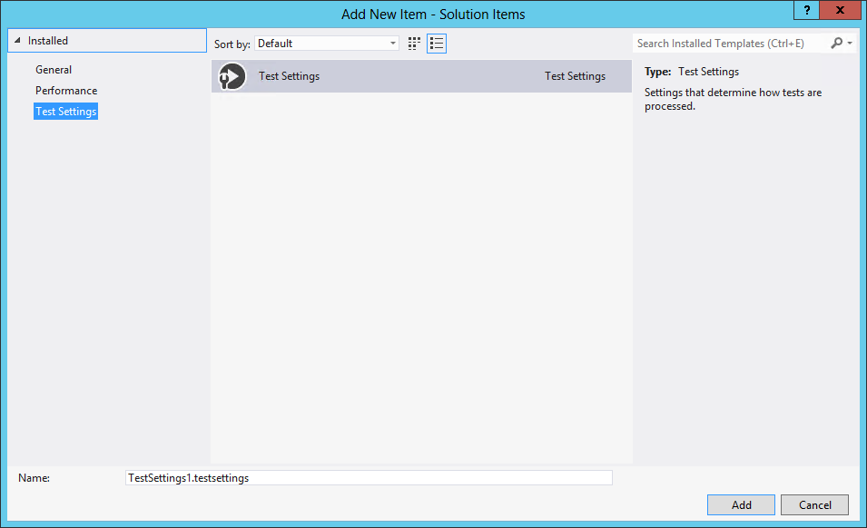

# BizTalk Server 2013: Using the Unit Testing Feature with Schemas and Maps

# Introduction
Testing is an important aspect of (BizTalk) application life cycle. Before a developer deploys his solution he needs to be confident that it will perform, and do the task(s) it is intended to do. It is a developer responsibility that he creates a robust application. Therefore he needs to unit test his BizTalk application artifacts before he deploys them for further testing.

A BizTalk developer has a couple of options when it comes to unit testing BizTalk artifacts. Testing of each can be done using a framework like BizUnit, or some of the other available tools offered through CodePlex, or Visual Studio. With BizTalk Server 2009 the unit test feature was introduced, which offered built-in developer support for testing schemas, maps and pipelines in Visual Studio. The test capabilities offered by Visual Studio in for BizTalk artifacts are the following:
* Validating an XML document instance.
* Testing a map.
* Unit test a schema, map and/or a pipeline.

This sample is a sample BizTalk solution to explain how we can use these unit test feature within Visual Studio to test Schemas and Maps.

# Testing Schemas Sample
To unit test a schema you can leverage the unit test framework in Visual Studio you need to use the following sample code:

    
    /// 
 
	///A test for PersonOrigin Constructor 
	///
 
	[TestMethod()] 
	public void PersonOriginConstructorTest() 
	{ 
		PersonOrigin target = new PersonOrigin(); 

		//=== Schema input file for validation ===// 
		string strSourcePO_XML = testContextInstance.TestDir + "..\\..\\..\\Files\\PersonOrigin.xml"; 

		//=== Validate the XML Input message against the schema ===// 
		Assert.IsTrue(target.ValidateInstance(strSourcePO_XML,  
			Microsoft.BizTalk.TestTools.Schema.OutputInstanceType.XML)); 
	}
    

# Testing Maps Sample
To unit test a map you can leverage the unit test framework in Visual Studio you need to use the following sample code:

    
    [TestMethod()] 
	public void HowMapsWorksMapTest() 
	{ 
		HowMapsWorks map = new HowMapsWorks(); 

		//=== Use the HelloWorld sample directory path for the message files ===// 
		string strSourcePO_XML = testContextInstance.TestDir + "..\\..\\..\\Files\\PersonOrigin.xml"; 
		string strDestInvoice_XML = testContextInstance.TestDir + "\\OUT\\PersonTarget2.xml"; 

		//=== Test the map by using the TestMap method of the TestableMapBase class ===// 
		map.ValidateOutput = true; 
		map.TestMap(strSourcePO_XML, 
					   Microsoft.BizTalk.TestTools.Schema.InputInstanceType.Xml, 
					   strDestInvoice_XML, 
					   Microsoft.BizTalk.TestTools.Schema.OutputInstanceType.XML); 

		//=== Output file should be created as a result of testing the map ===// 
		Assert.IsTrue(File.Exists(strDestInvoice_XML)); 
	}
    
Unfortunately, there is a bug with Map Unit Test inside Microsoft.BizTalk.TestTools.dll.

Microsoft had missed on to upgrade TestableMapBase class. They still using the BTSXslTransform instead of using XslCompiledTransform which will cause the TestMap() function to failed.

## Workaround 1 (Custom wrapper)

You need to test the map by using the TestMap method of a custom TestableMapBase class that uses the XslCompiledTransform. This class is basically an improved clone of the class present in the Microsoft.BizTalk.TestTools DLL.

You can find this wrapper (provide by  shadabanwer) here: Map Unit test does not work in BizTalk 2013 because TestableMapBase class is not correct

You must use this workaround until Microsoft fix this bug. However, there is a problem with schema (input and output) validation options... so I decide to recreated a new custom wrapper based on Microsoft.BizTalk.TestTools.dll and the solution provided by  shadabanwer.

    
    [TestMethod()] 
	public void HowMapsWorksMapTest() 
	{ 
		HowMapsWorks map = new HowMapsWorks(); 

		//=== Map input file instance to be mapped  ===// 
		string strSourcePO_XML = testContextInstance.TestDir + "..\\..\\..\\Files\\PersonOrigin.xml"; 
		//=== Path for the Map output file instance with the result of the transformation  ===// 
		string strDestInvoice_XML = testContextInstance.TestDir + "\\Out\\PersonTarget2.xml"; 

		//WORKAROUND SOLUTION to test maps 
		SandroPereira.BizTalk.MapTestTools.TestableMapBase mapper = new SandroPereira.BizTalk.MapTestTools.TestableMapBase(); 

		mapper.Mapper = map; 
		mapper.Mapper.ValidateOutput = true; 

		//=== Test the map by using the TestMap method of a custom TestableMapBase class ===// 
		//=== that uses the XslCompiledTransform. This class is basically an improved    ===// 
		//=== clone of the class present in the Microsoft.BizTalk.TestTools DLL          ===// 
		mapper.TestMap(strSourcePO_XML, 
			Microsoft.BizTalk.TestTools.Schema.InputInstanceType.Xml, 
			strDestInvoice_XML, 
			Microsoft.BizTalk.TestTools.Schema.OutputInstanceType.XML); 

		//=== Output file should be created as a result of testing the map ===// 
		Assert.IsTrue(File.Exists(strDestInvoice_XML)); 
	}
    

## Workaround 2 (add .testsettings file) - Recommended
Unit tests in Visual Studio 2012 can be configured by using a .runsettings file. For example, you can change the .NET Framework on which the tests will be run, the directory where test results are delivered, and the data collected during a test run.

.runsettings is new in Visual Studio 2012. If you’re familiar with unit testing in previous versions of Visual Studio, you might know about .testsettings files. You can still use .testsettings in Visual Studio 2012, so any test configurations you wrote for previous editions will still work. But .testsettings can be used only to configure tests written for the MSTest adapter. By contrast, .runsettings can be used with any of the adapters built for the extensible unit test framework in Visual Studio 2012, such as xUnit.net and NUnit.

Tests that use .testsettings files might run more slowly than tests that use .runsettings files, or for which there is no configuration file at all.

You still need a .testsettings file for some kinds of tests:
* Tests that are deployed in a lab environment.
* Web performance and load tests.
* Customizing some types of diagnostic data adapters, such as IntelliTrace and ent log
* BizTalk Server maps (workaround)

So to fixed this problem using the Test Settings file to our BizTalk Solution, to accomplish this, we need to:
* Right click on the BizTalk solution name: “Solution ‘UnitTestingFeatureWithMaps’ (2 projects)”, and select “Add” and them “New Item…”
* In the “Add New Item – Solution Items” dialog box, expand "Installed" and then choose "Test Settings".
* From the list of items, select "Test Settings".

* In the Name box, enter "TestSettings.testsettings", and then click "Add".
* This will open a new window for us to specify the settings of the test settings file, just leave the default setting by click “Close”.

You can add more than one test settings file if you want to be able to switch quickly between different settings.
* On the Visual Studio main menu choose "Test", choose "Test Settings", and then choose "Test Settings File".
* In the "Open Setting File" window select the test setting file that we previous create: "TestSettings.testsettings"

If we perform the tests again, we will notice that the "Microsoft.BizTalk.TestTools.BizTalkTestAssertFailException: Transform Failure" is solved and the only error that is happening is about a Map output validation failure (intentionally present)

# Read more about it
You can read more about this topic here: [BizTalk Server 2013: Step-by-Step to implement Unit Testing in Schemas and Maps
](https://blog.sandro-pereira.com/2014/08/28/biztalk-server-2013-step-by-step-to-implement-unit-testing-in-schemas-and-maps/)

# About Me
**Sandro Pereira** | [DevScope](http://www.devscope.net/) | MVP & MCTS BizTalk Server 2010 | [https://blog.sandro-pereira.com/](https://blog.sandro-pereira.com/) | [@sandro_asp](https://twitter.com/sandro_asp)

