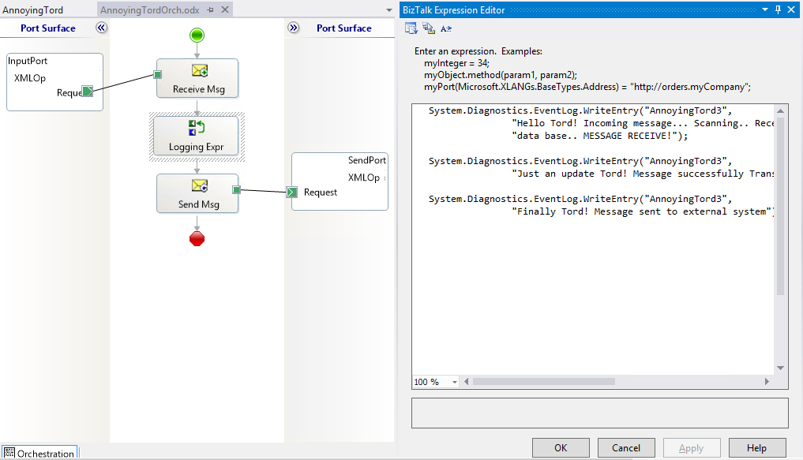

# Moving Event Source To Different Event Log (Administration)

# Introduction
Many time in BizTalk developers like to write informations that will help them tracking and debuging there orchestrations like:
* Message received
* Message successfully Transformed
* Message sent to external system

And for that they normally use the following code:
    
    System.Diagnostics.EventLog.WriteEntry("AnnoyingTord3",  
               "Just an update Tord! Message successfully Transformed");
    

The problem using this code is that by default in the Application Log. Application event log is used to application installed in your server/machine like BizTalk Server to log the exceptions or problems and you should keep it clean. in other to proper monitor and find problems with your environment.

And also this are unnecessary information that is being logged in the Application Log in that don't provide any additional information to BizTalk Administrators.

# Building the Sample
In this sample you will find a simple orchestration that will receive any XML message and will log some traditional tracking information that developers normally do in their orchestrations… I call this trying to annoying Tord Glad Nordahl (my friend and one of the best BizTalk Administrator that I know) and that is always complaining about developer doing this.

## What is that the Admin does normally?
They ask the developer to change is code, that already is deployed in all the environments, to not write in the application log

However change is hard - Getting others to change can be impossible or a big challenge

## What is that the Admin should do?
Let the developer by happy by writing in the Event Viewer...

But take back the control of your environment by easily creating or using PowerShell script

    
    foreach ($LogSource in $LogSources) {  
		Remove-EventLog -Source $LogSource  
	}  
	  
	$logFileExists = Get-EventLog -list | Where-Object {$_.logdisplayname -eq $LogName}   
	if (! $logFileExists) {  
		$LogSources | %{  
			New-EventLog -LogName $LogName -Source $_  
		}  
	  
		# Compose Key:  
		$LogPath = 'HKLM:\SYSTEM\CurrentControlSet\services\eventlog\'+$LogName;  
		if(Test-Path $LogPath)  
		{  
			$acl = Get-Acl $LogPath  
			$GpOrUsers | %{  
				$ace = New-Object System.Security.AccessControl.RegistryAccessRule $_,'WriteKey, ReadKey','allow'  
				$acl.AddAccessRule($ace)  
				#Set-Acl $LogPath $acl  
			}  
		}else{Write-Error "Cannot acesss log $LogName"}  
	}  
	else {  
		$LogSources | %{  
			New-EventLog -LogName $LogName -Source $_  
		}  
	}
        

You can find the entired PowerShell script here: [BizTalk DevOps: Moving an Event Source To a Different/Custom Windows Event Log](https://gallery.technet.microsoft.com/scriptcenter/BizTalk-DevOps-Moving-an-e4c23236)

# Read more about it
You can read more about this topic here: [Why is so hard to make a simple If-Then-Else Functoid? … well, not anymore!
](https://blog.sandro-pereira.com/2016/02/10/why-is-so-hard-to-make-a-simple-if-then-else-functoid-well-not-anymore/)

# About Me
**Sandro Pereira** | [DevScope](http://www.devscope.net/) | MVP & MCTS BizTalk Server 2010 | [https://blog.sandro-pereira.com/](https://blog.sandro-pereira.com/) | [@sandro_asp](https://twitter.com/sandro_asp)

