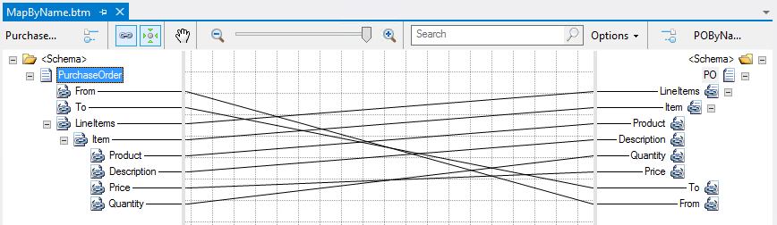
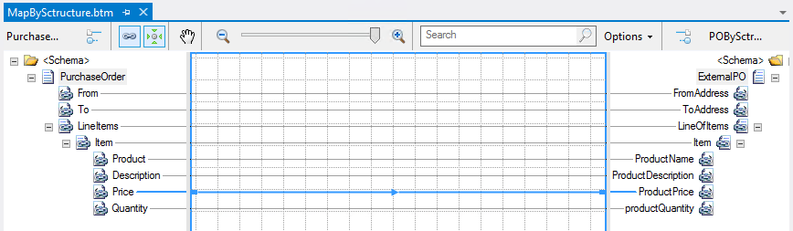
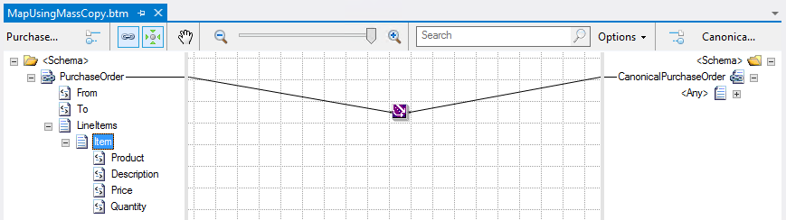

# Automatically Link The Record Elements By Structure, Name or Using Mass Copy

# Introduction
Exchanging or routing messages between existing applications, systems or external partners is one of the many common scenarios in Enterprise integration solutions. And sometimes they are build base on the same data model, however because they are built in different systems and teams they can have slight small differences like: the order of the elements, the name of the elements, the structure or even the namespace. As a result of that we need to be able to transformed the original message to the expect message by that systems.

BizTalk Mapper provides you with just-in-time assistance, through a shortcut menu, when you create links between two record elements of source and destination schemas:
* You can create multiple links simultaneously if:
  * Relevant schema structures must be the same (node names are different but order is the same or similar;
  * Or Record, elements or field names must match;
* You can manually create single links by dragging and dropping the source element to the destination element, if the destination schema don’t have a similar structures or the same names

# Building the PurcharseOder Sample
This demo will provide with 3 small samples for you to understand the differences of the last 3 options (Link by Structure, Link By Name, Mass Copy) that will be descrived below.

So for accomplish that, open your map and:
* Drag-and-drop the root name of the source schema, in this case “PurchaseOrder” to the root name of the destination schema, which will be in this case “PO”, and release the direct button of the mouse.
* A windows assistance will pop up were you can select create record-to-record links automatically in the following ways:
  * **Direct Link**: Using this technique, the BizTalk Mapper links the record from source schema to the selected record in the destination schema. This will not copy any kind of hierarchy structure from the source to the destination, it will only link the record or node. 
  * **Link by Structure**: Using this technique, the BizTalk Mapper attempts to match the Record and Field nodes within the Record nodes being linked according to the structures of those Record nodes, regardless of names of the corresponding nodes within those structures.

  * **Link By Name**: Using this technique, the BizTalk Mapper attempts to match the Record and Field nodes within the Record nodes being linked according to the names of the corresponding nodes, regardless of their structure, within the Record nodes being linked.

  * **Mass Copy**: The Mass Copy functoid enables your maps to use schemas that include any and anyAttribute elements. For information about the functoids available in BizTalk Mapper.

 
# Read more about it
You can read more about this topic here: [BizTalk Mapper Patterns: Automatically Link The Record Elements By Structure, Name or Using Mass Copy](https://blog.sandro-pereira.com/2013/12/28/biztalk-mapper-patterns-automatically-link-the-record-elements-by-structure-name-or-using-mass-copy/)

# About Me
**Sandro Pereira** | [DevScope](http://www.devscope.net/) | MVP & MCTS BizTalk Server 2010 | [https://blog.sandro-pereira.com/](https://blog.sandro-pereira.com/) | [@sandro_asp](https://twitter.com/sandro_asp)

