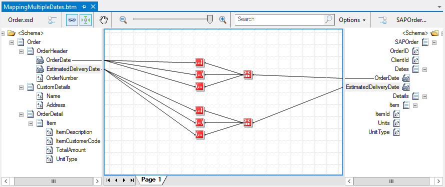
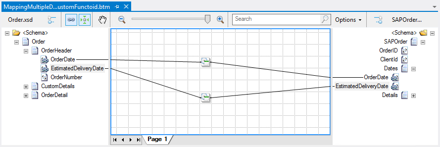
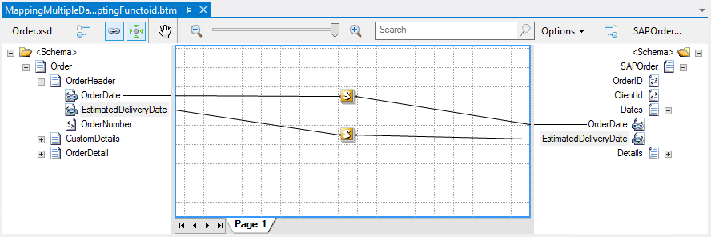

# BizTalk Mapper: Built-in Functoids, Scripting Functoid and Custom Functoids

# Introduction
One question that we always try to answer or explain is when to use the Built-in Functoids (or basic/standard Functoids), Scripting Functoids or when to developer Custom Functoids. Well there isn’t a correct answer to this question and we only can suggest some best practices for you to use.

You need to remember and learn that there’s never only a single way and there are no right or wrong way method to solve a mapping problem, we can find more effective ways (performances) than others or easiest ways to solve the problem, yet the output generated will be the same. Quite often, deciding which way is the best approach to use or have the right balance between the easier and effective way can be difficult and often the approach used depend on the expertise and personal choice of the developers or company guidelines

# Building the Sample
I can give this example also reference by many books: if you need to reformat the date format from the source schema (yyyyMMdd) to your destination schema dd/MM/yyyy.

You can easily implement this transformation rule by using only four simple string Functoids:
* Three extraction string Functoids that break the date into year, month and day
* And a String Concatenate Functoid then builds the new string

Other suggestion is to create a custom Functoid because:
* You will reduce the amount of work needed to accomplish this rule;
* You will be able to use them in all your maps

We alternately could also use a custom inline C# script to reduce the amount of work needed to accomplish this rule:

# Read more about it
You can read more about this topic here: [BizTalk Mapping Patterns and Best Practices book [Free] released](https://blog.sandro-pereira.com/2014/09/28/biztalk-mapping-patterns-and-best-practices-book-free-released/)

# About Me
**Sandro Pereira** | [DevScope](http://www.devscope.net/) | MVP & MCTS BizTalk Server 2010 | [https://blog.sandro-pereira.com/](https://blog.sandro-pereira.com/) | [@sandro_asp](https://twitter.com/sandro_asp)

