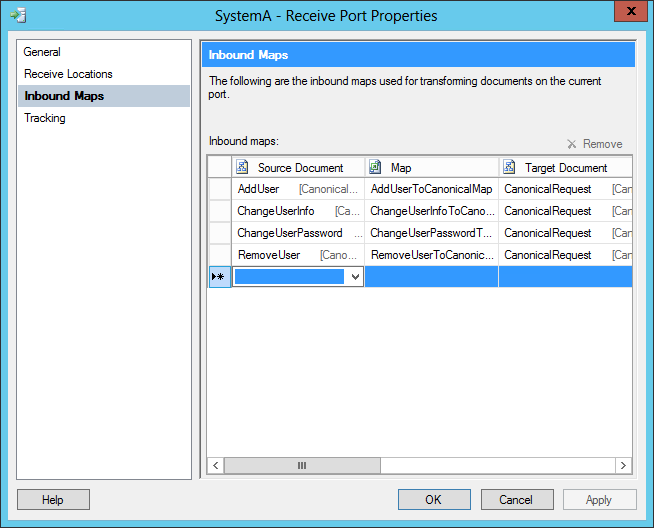

# BizTalk Mapper Patterns: Canonical Data Model Pattern

# Introduction
When several applications need to work together through Messaging and each application has its own internal data format, most of the times semantically equivalent, we sometimes want or need to minimize all these dependencies and implement an additional mechanism of indirection between the data formats for each individual application.

In an Enterprise application integration (EAI) scenario it is quite common for an enterprise to receive messages from different systems that may have the same meaning but follow different formats but were developed independently based on incompatible or different data models, yet they must share information efficiently and accurately in order to effectively support the business. Different systems can have different terms for the same concept, leading to miscommunication and errors of interpretation (i.e. a bundle product can be named also as a pack product or a compose product). Canonical Data Modeling is a technique for developing and maintaining a logical model of the data required to support the needs of the business for a subject area and it is intended to reduce costs and standardize on agreed data definitions associated with integrating business systems.

The **Canonical Data Model** (CMD) will ensure loose coupling between applications, and if a new application is added to the integration solution, the only transformation between the Canonical Data Model need to be created, independent of the number of applications that already participate.

 
# Read more about it
You can read more about this topic here: [BizTalk Mapping Patterns and Best Practices book [Free] released](https://blog.sandro-pereira.com/2014/09/28/biztalk-mapping-patterns-and-best-practices-book-free-released/)

# About Me
**Sandro Pereira** | [DevScope](http://www.devscope.net/) | MVP & MCTS BizTalk Server 2010 | [https://blog.sandro-pereira.com/](https://blog.sandro-pereira.com/) | [@sandro_asp](https://twitter.com/sandro_asp)

