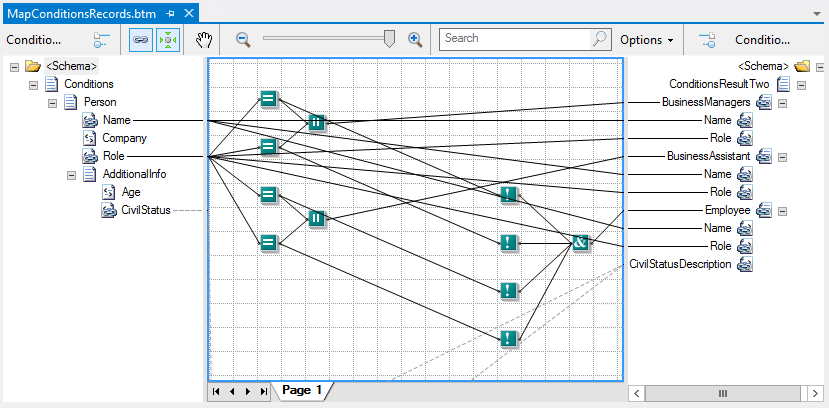

# BizTalk Mapper Patterns: Conditional Pattern

# Introduction
When exchanging messages in an Enterprise Application Integration (EAI) or Business-to-Business (B2B) scenario it is quite common the need to retrieve only the portion of data from the message by some filter or under a specific condition based on some criteria. This way we need to be able to apply Conditional Mapping technics.

Conditional mapping is a fixed condition that helps us to filter the result set that is being mapped from the source message.

# Building the Sample

## Check Existence
One of the most common problems that we need to deal and perform validation when we are mapping different or similar schemas is the different and complexity types of elements properties that we can specify inside the schemas

## If…Then Condition
The If...Then statement is the most basic of all the control flow statements. It tells your program to execute a certain section of code only if a particular test evaluates to true

## If…Then…Else Condition
You can use If...Then...Else statements to execute blocks of statements depending on the Boolean value of a condition. It will provide a secondary path of execution when an "if" clause evaluates to false. The condition usually results from a comparison of two values, but it can be any expression that evaluates to a Boolean value (True or False). This includes values of other data types, such as numeric types, that have been converted to Boolean.

## Switch Condition (or nested conditions)
The switch statement helps you controlling complex conditional and branching operations transferring the control to one of the several statements, depending on the value of a condition. This can also be translated in a sequence of If...Then...Else statements.
 
# Read more about it
You can read more about this topic here: [BizTalk Mapping Patterns and Best Practices book [Free] released](https://blog.sandro-pereira.com/2014/09/28/biztalk-mapping-patterns-and-best-practices-book-free-released/)

# About Me
**Sandro Pereira** | [DevScope](http://www.devscope.net/) | MVP & MCTS BizTalk Server 2010 | [https://blog.sandro-pereira.com/](https://blog.sandro-pereira.com/) | [@sandro_asp](https://twitter.com/sandro_asp)

