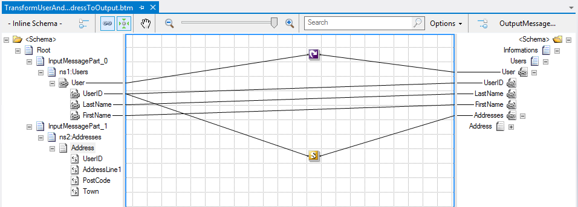

# BizTalk Mapper Patterns: Content Enricher Pattern
This can also be treated has Working with Multiple input messages or joining messages (Content Enricher Pattern)

# Introduction
When sending messages from one system to another it is common for the target system to require more information than the source system can provide so we will need to gather information from different sources, his is also known as [Scatter-Gather Pattern](https://www.enterpriseintegrationpatterns.com/patterns/messaging/BroadcastAggregate.html). This is a common behavior that we all certainly come across in orchestrations.

# Building the Sample
In this demo we will have to different messages gathered from your internal or external systems:
* **Users**: With the User id and the First and Last Name of the users
* And **Address**: With the User Id and the addresses information of the user (Address, Town and Post Code).

And we basically want to merge this information base on the User Id knowing that one user can have multiple addresses.

First you have to take two things into consideration:
* This type of mapping is only allowed inside the Orchestration.
* And you cannot create this from Visual Studio as a normal map item, this type of map can only be created from “Transform Shape” inside the orchestration when you are developing this orchestration in the Visual Studio.

## Different approaches to solve the problem

### First Solution: Using only Functoids
As a developer the first approach we think is to try to solve this mapping problem using only the available functoids, i.e. without custom XSLT or custom C# code. I quickly discarded this option and you will see why in the demo.

### Second Solution: Using Functoids and Custom C#
I soon realized that if I wanted a really good and effective solution, I would have to use some type of custom code. In this second approach I try to use the same concept of the first, but try a different approach for solving the equal condition and for that I used the concept of a global variable inside the map and two C# functions.

The limitations or disadvantages of this approach are:
* **Lack of performance**: If the destination schema has many elements it takes to much work to do this kind of mapping because for each iteration inside the “User” loop we need to travel all the elements inside the “Address” record in order to find the correct addresses associated with the user in question.

### Third Solution: Using Functoids and Custom XSLT Template
After analyzing some of the advantages and disadvantages, for me this is the best approach to accomplish this type of mapping problem, because basically solves the limitations of previous approach, is using custom XSLT and XPath code.

The limitations or disadvantages of this approach are:
* Because we use scripting functoids we cannot read the entire map visually. We need to open the functoids and read the XSLT code.
* We need basic knowledge of XSLT and XPath.
 
# Read more about it
You can read more about this topic here: [BizTalk Mapping Patterns and Best Practices book [Free] released](https://blog.sandro-pereira.com/2014/09/28/biztalk-mapping-patterns-and-best-practices-book-free-released/)

# About Me
**Sandro Pereira** | [DevScope](http://www.devscope.net/) | MVP & MCTS BizTalk Server 2010 | [https://blog.sandro-pereira.com/](https://blog.sandro-pereira.com/) | [@sandro_asp](https://twitter.com/sandro_asp)

