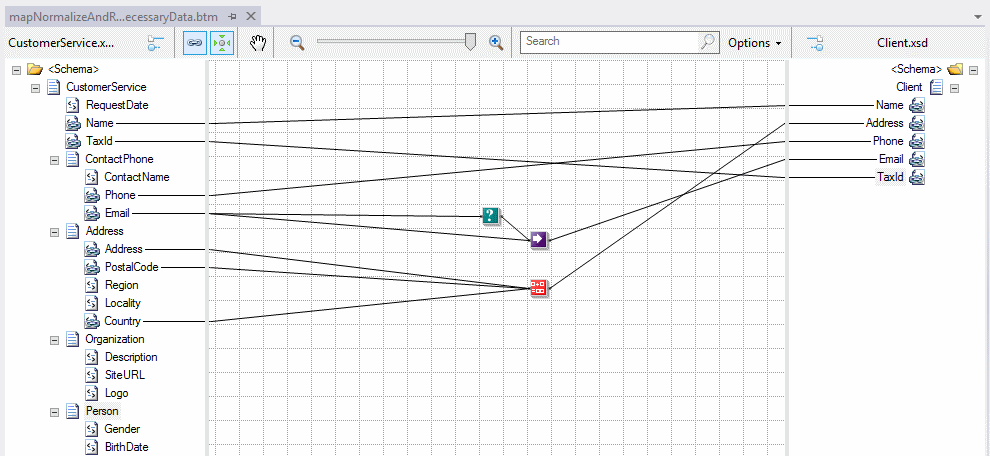
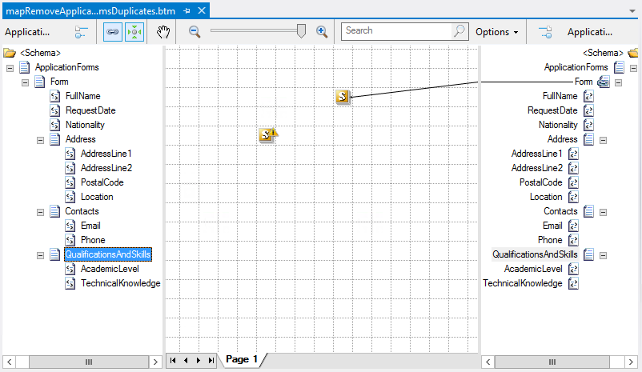

# BizTalk Mapper Patterns: Content Filter Pattern (Data Cleaning Pattern)

# Introduction

## Content Filter Pattern
In this scenario the target system will require less information than the source system will provide, for example: the source system will provided the customer ID, customer name and address but the target system will only need the customer ID.

Here we will remove unimportant data items from a message, sometimes also based on specific criteria, and we leave only the important ones.

The Content Filter does not necessarily just remove data elements and sometimes can also be used to simplify the structure of the message.

Removing unnecessary data from the source schema and even normalize the data existent there is normally an easy task inside mappers.

Again you must be aware that BizTalk maps has always its focus on the final document, so it’s doesn’t care if you are using or not all the element in the source schema as long as the structure of the final document be respected.

So if you don’t want to map or use certain elements that exist in the source schema you simple need to not create rules to apply to that elements, for example: don’t link them to any functoid or elements in the destination rules.

## Data Cleaning Pattern
So we have seen that this pattern can be used to remove unnecessary data elements or to simplify the structure of the message. However we can also apply a sub-pattern call Data cleaning (also called data cleansing or data scrubbing) for detecting and removing errors, duplications and inconsistencies from data in order to improve the quality of data
 
# Read more about it
You can read more about this topic here: [BizTalk Mapping Patterns and Best Practices book [Free] released](https://blog.sandro-pereira.com/2014/09/28/biztalk-mapping-patterns-and-best-practices-book-free-released/)

# About Me
**Sandro Pereira** | [DevScope](http://www.devscope.net/) | MVP & MCTS BizTalk Server 2010 | [https://blog.sandro-pereira.com/](https://blog.sandro-pereira.com/) | [@sandro_asp](https://twitter.com/sandro_asp)

