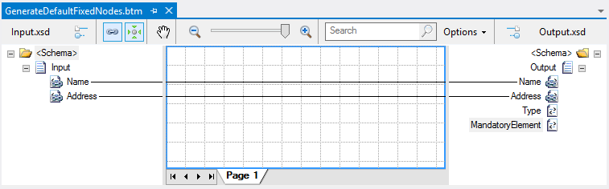

# BizTalk Mapper: GenerateDefaultFixedNodes attribute of the mapsource element

# Introduction
When the Mapper is using a schema that has a very large instance footprint with deep complex structures and/or recursive nodes, testing the map, validating the map, or compiling the map could take a long time or, in the worst case, result in an "out of memory" error. This could happen with small, complex schemas as well as with large schemas.

The problem with complex schemas is due to the fact that the Mapper has to recursively load the entire schema tree looking for nodes that either have links connected to them or have the Value property set on them. You can alleviate this problem by setting the **GenerateDefaultFixedNodes** flag of the mapsource element in the .btm files to **No**.

With this setting, the Mapper does not need to create internal compiler nodes associated with each schema node of a target schema. Only linked nodes are taken into account by the compiler. This significantly reduces the memory consumption and speeds up the process when doing a "test map" or "validate map" operation, compiling the map, or saving the map.

Of course describing this behavior with a large message or with a message that has this problem is a challenger, so we will use a small example for demonstration, for example if we have a mandatory field element in the destination schema with a default value specify, in this case the field element **Type** has a default value specify as **Person**:

It will generate an invalid message and will raise an error if we validate the output schema:

> Output validation error: The element 'Output' in namespace 'http://GenerateDefaultFixedNodes.Output' has invalid child element 'MandatoryElement'. List of possible elements expected: 'Type'.

To circumvent this problem you need to:
* Specify the required values have to be set again explicitly in the map by using for example a Functoid or by using the Value property in the destination Schema Properties (see Working with Constant Values inside maps section in the BizTalk Mapper Patterns chapter)
* Or you can set the GenerateDefaultFixedNodes flag to “RequiredDefaults”, which means that all required nodes are taken into account. This covers linked nodes, nodes that have default values, nodes with the MinOccurs property set to greater than or equal to one, and nodes whose parents are required.
 
# Read more about it
You can read more about this topic here: [BizTalk Mapping Patterns and Best Practices book [Free] released](https://blog.sandro-pereira.com/2014/09/28/biztalk-mapping-patterns-and-best-practices-book-free-released/)

# About Me
**Sandro Pereira** | [DevScope](http://www.devscope.net/) | MVP & MCTS BizTalk Server 2010 | [https://blog.sandro-pereira.com/](https://blog.sandro-pereira.com/) | [@sandro_asp](https://twitter.com/sandro_asp)

