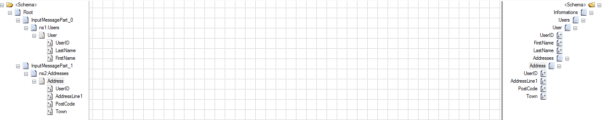
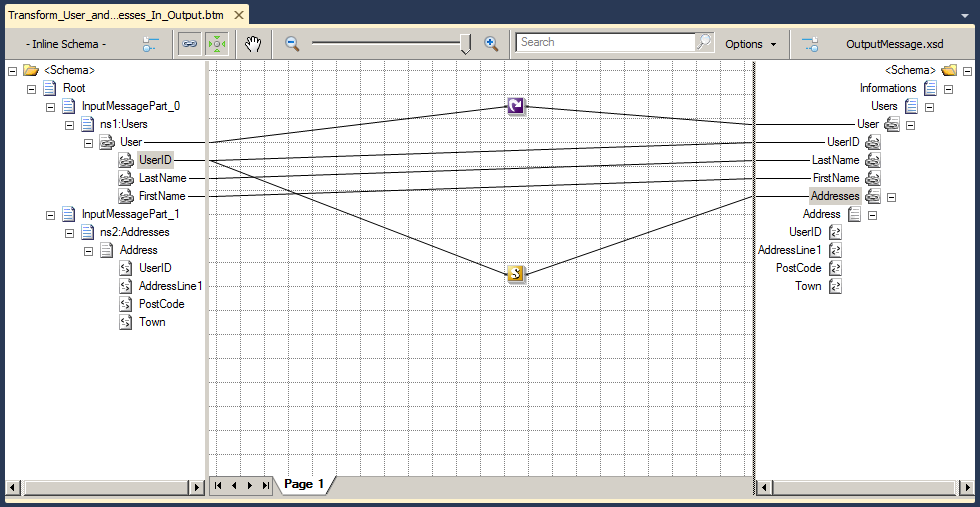

# BizTalk Mapper Patterns: Grouping Pattern 

# Grouping elements from different messages in BizTalk Maps
First of all let me tell you that for me there is no perfect solution to solve a particular mapping problem, often there are several ways to solve the problem and how it’s solved always depends in the experience and knowledge that you have with the tool or/and with XSLT (of course sometimes there are some solutions better than other or with higher performance)

We want to combine data from two different messages into one, more specifically, we want to combine each user with his address and each user can have multiple addresses.

This is the transformation screenshot:

Sample of Users Input message:

    
    <ns0:Users xmlns:ns0="http://BizTalk_Server_GenerationFichiersReleve.test"> 
	  <User> 
		<UserID>1</UserID>  
		<LastName>Nicolas</LastName> 
		<FirstName>Brun</FirstName> 
	  </User> 
	  <User> 
		<UserID>2</UserID> 
		<LastName>Philippe</LastName> 
		<FirstName>Picard</FirstName> 
	  </User> 
	</ns0:Users>
	Sample of AddressesInput message:
	XML
	<ns0:Addresses xmlns:ns0="http://BizTalk_Server_GenerationFichiersReleve.Test2"> 
	  <Address> 
		<UserID>1</UserID> 
		<AddressLine1>245 rue françois 1er </AddressLine1> 
		<PostCode>69001</PostCode> 
		<Town>Lyon</Town> 
	  </Address> 
	  <Address> 
		<UserID>2</UserID> 
		<AddressLine1>18 avenue Gerard Majax</AddressLine1> 
		<PostCode>75001</PostCode> 
		<Town>Paris</Town> 
	  </Address> 
	  <Address> 
		<UserID>2</UserID> 
		<AddressLine1>450 rue Michou</AddressLine1> 
		<PostCode>75005</PostCode> 
		<Town>Paris</Town> 
	  </Address> 
	</ns0:Addresses>
    

Sample of the expected result:

    
    <ns0:Informations xmlns:ns0="http://BizTalk_Server_GenerationFichiersReleve.Test3"> 
	  <Users> 
		<User> 
		  <UserID>1</UserID> 
		  <LastName>Nicolas</LastName> 
		  <FirstName>Brun</FirstName> 
		  <Addresses> 
			<Address> 
			  <UserID>1</UserID> 
			  <AddressLine1>245 rue françois 1er </AddressLine1> 
			  <PostCode>69001</PostCode> 
			  <Town>Lyon</Town> 
			</Address> 
		  </Addresses> 
		</User> 
		<User> 
		  <UserID>2</UserID> 
		  <LastName>Philippe</LastName> 
		  <FirstName>Picard</FirstName> 
		  <Addresses> 
			<Address> 
			   <UserID>2</UserID> 
			   <AddressLine1>18 avec Gerard Majax</AddressLine1> 
			   <PostCode>75001</PostCode> 
			   <Town>Paris</Town> 
			</Address> 
			<Address> 
			   <UserID>2</UserID> 
			   <AddressLine1>450 rue Michou</AddressLine1> 
			   <PostCode>75005</PostCode> 
			   <Town>Paris</Town> 
			</Address> 
		  </Addresses> 
		</User> 
	  </Users> 
	</ns0:Informations>

# Building the Sample
As I said earlier, there are several ways to solve a particular mapping problem, this is the solution I like :).

The first part is a normal drag-and-drop mapping problem however decided to create a template to map the second part of the message (addresses), using a scripting functoid with a inline XSLT call template with the following code:

    
    <xsl:template name="AddressTemplate"> 
	<xsl:param name='id' select='UserID'/> 
	 
		<Addresses> 
		<xsl:for-each select="../../../InputMessagePart_1/s0:Addresses/Address[UserID=$id]"> 
		 
		   <Address> 
			 <UserID> 
				 <xsl:value-of select="UserID/text()"/> 
			 </UserID> 
			 <AddressLine1> 
				 <xsl:value-of select="AddressLine1/text()"/> 
			 </AddressLine1> 
			 <PostCode> 
				 <xsl:value-of select="PostCode/text()"/> 
			 </PostCode> 
			 <Town> 
				 <xsl:value-of select="Town/text()"/> 
			 </Town> 
		  </Address> 
		 
		  </xsl:for-each> 
		</Addresses>
	</xsl:template> 
    

# Read more about it
You can read more about this topic here: [BizTalk Training – Mapping – Grouping elements from different messages in BizTalk Maps](https://blog.sandro-pereira.com/2012/06/05/biztalk-training-mapping-grouping-elements-from-different-messages-in-biztalk-maps/)

# About Me
**Sandro Pereira** | [DevScope](http://www.devscope.net/) | MVP & MCTS BizTalk Server 2010 | [https://blog.sandro-pereira.com/](https://blog.sandro-pereira.com/) | [@sandro_asp](https://twitter.com/sandro_asp)

