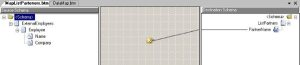
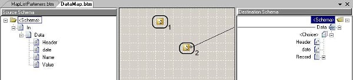

# BizTalk Mapper Patterns: Grouping Pattern 

# BizTalk Mapper Patterns: Selecting distinct nodes (grouping)
One of the more challenging things to do in XSL 1.0 was getting a distinct list of values from a set of nodes. There is no simple syntax to write this type of XPath query. However this is very easy to do in XSL 2.0:

    
    <xsl:for-each select=”distinct-values(…)”>
    

But unfortunately BizTalk do not support XSL 2.0.

# Building the Sample

## Sample 1: List of external Partners
In the Sample 1, the transformation that needed to take place was to get the list of External Partners from a list of external employees.

    
    <ns0:ExternalEmployees xmlns:ns0=”http://SelectDistinctValues.Input”>
	<Employee>
	<Name>Sandro Pereira</Name>
	<Company>DevScope</Company>
	</Employee>
	<Employee>
	<Name> Employee 1</Name>
	<Company>DevScope</Company>
	</Employee>
	<Employee>
	<Name>DemoEmployee2</Name>
	<Company>DemoCompany2</Company>
	</Employee>
	<Employee>
	<Name> Employee 2</Name>
	<Company>DevScope</Company>
	</Employee>
	<Employee>
	<Name>DemoEmployee</Name>
	<Company>DemoCompany</Company>
	</Employee>
	</ns0:ExternalEmployees>
    

The first thing we need to do is to drag a Script functoid onto the Grid. Then drag a line to the element that we want to create output for.

 
To create the output in the format that we want we will start with the following XSLT.

    
    <xsl:variable name=”unique-companies” select=”//Employee[not(Company=preceding-sibling::Employee/Company)]/Company” />
    

This creates variable named unique-companies and populates with a list of unique companies nodes. Now we need to start the output of our nodes and then loop through the companies. The following code will do that.

    
    <xsl:for-each select=”$unique-companies”>
	<PartnerName><xsl:value-of select=”.”/></PartnerName>
	</xsl:for-each>
    

The output looks like this:

    
    <ns0:ListPartners xmlns:ns0=”http://SelectDistinctValues.Output1″>
	<PartnerName>DevScope</PartnerName>
	<PartnerName>DemoCompany2</PartnerName>
	<PartnerName>DemoCompany</PartnerName>
	</ns0:ListPartners>
    

## Sample 2: Question in MSDN thread

This is a response to a question in [MSDN thread](http://social.msdn.microsoft.com/Forums/en-US/biztalkgeneral/thread/d9dfe469-09fa-4a4e-ad7d-a2a8d061f0c7)

Giving data like this:

    
    <Data Header=”AAA” date=”2008-10-28″ Name=”a1″ Value=”1.0″ />
	<Data Header=”AAA” date=”2008-10-28″ Name=”a2″ Value=”2.0″ />
	<Data Header=”AAA” date=”2008-10-28″ Name=”a3″ Value=”3.0″ />
	<Data Header=”BBB” date=”2008-10-28″ Name=”a1″ Value=”1.0″ />
	<Data Header=”BBB” date=”2008-10-28″ Name=”a2″ Value=”2.0″ />
	<Data Header=”BBB” date=”2008-10-28″ Name=”a3″ Value=”3.0″ />
    

It was need to map it to at schema like this:

    
    <Data>
	  <Header>AAA</Header>
	  <date>2008-10-28</date>
	  <Record>
	   <Name>a1</Name>
	   <Value>1.0</Value>
	   <Name>a2</Name>
	   <Value>2.0</Value>
	   <Name>a3</Name>
	   <Value>3.0</Value>
	  </Record>
	  <Header>BBB</Header>
	  <date>2008-10-28</date>
	  <Record>
	   <Name>a1</Name>
	   <Value>1.0</Value>
	   <Name>a2</Name>
	   <Value>2.0</Value>
	   <Name>a3</Name>
	   <Value>3.0</Value>
	  </Record>
	</Data>
    

The logic is that you have to get the distinct values from Header, and then for all this distinct values select all element from this particular value, in this sample all element that have AAA in Header and then all BBB.

The map looks like this:

Basically I use two functoid scripts with inline XSLT:
* In the functoid 1, I created a template that get all records for a specific Header send by parameter

    
    <xsl:template name=”NameValueTemplate”>
	<xsl:param name=”param1″ />
	<xsl:for-each select=”//Data[@Header=$param1]“>
	<xsl:element name=”Name”><xsl:value-of select=”@Name” /></xsl:element>
	<xsl:element name=”Value”><xsl:value-of select=”@Value” /></xsl:element>
	</xsl:for-each>
	</xsl:template>
    

* In the functoid 2, I select all distinct Header and call the template for each header

    
    <xsl:element name=”Data”>
	<xsl:for-each select=”Data[not(@Header=preceding-sibling::Data/@Header)]“>
	<xsl:element name=”Header”><xsl:value-of select=”@Header” /></xsl:element>
	<xsl:element name=”date”><xsl:value-of select=”@date” /></xsl:element>
	<xsl:element name=”Record”>
	<xsl:call-template name=”NameValueTemplate”>
	<xsl:with-param name=”param1″ select=”string(@Header)” />
	</xsl:call-template>
	</xsl:element>
	</xsl:for-each>
	</xsl:element>
    

# Sample 3 - Grouping Multiple records into a single
In the Sample 3, I want to be able to find distinct persons by name, i.e. we assume that same name is equal to the same person and get their nationalities

    
    <ns0:Persons xmlns:ns0="http://SelectDistinctValues.InputPersons">
		<Person>
			<Name>Sandro Pereira</Name>
			<Nationality>Portuguese</Nationality>
			<Email>sandro@email</Email>
		</Person>
		  <Person>
			<Name>Person1</Name>
			<Nationality>Portuguese</Nationality>
			<Email>email1@email</Email>
		</Person>
		  <Person>
			<Name>Person1</Name>
			<Nationality>English</Nationality>
			<Email>email2@email</Email>
		</Person>
		  <Person>
			<Name>Person2</Name>
			<Nationality>Portuguese</Nationality>
			<Email>email@email</Email>
		</Person>
	</ns0:Persons>
    

The map looks like this:

Basically I use three functoid scripts with inline XSLT:
* In the functoid 1 I created a template that get all nationalities for a specific person (Name) send by parameter

    
    <xsl:template name="NationalityTemplate">
	<xsl:param name="param1" />
	<xsl:for-each select="//Person[Name=$param1]">
	<xsl:element name="Nationality"><xsl:value-of select="Nationality" /></xsl:element>
	</xsl:for-each>
	</xsl:template>
    

* In the functoid 2 I created a template that get the last email found for a specific person (Name) send by parameter

    
    <xsl:template name="EmailTemplate">
	<xsl:param name="paramName" />
	<xsl:for-each select="//Person[Name=$paramName]">
	  <xsl:if test="position()=last()">
		<xsl:element name="Email"><xsl:value-of select="Email" /></xsl:element>
	  </xsl:if>
	</xsl:for-each>
	</xsl:template>
    

* In the functoid 3, I select all distinct Persons and call the template for each

    
    <xsl:for-each select="//Person[not(Name=preceding-sibling::Person/Name)]">
	<xsl:element name="Person">
	<xsl:element name="Name"><xsl:value-of select="Name" /></xsl:element>
	<xsl:call-template name="NationalityTemplate">
	  <xsl:with-param name="param1" select="string(Name)" />
	</xsl:call-template>
	<xsl:call-template name="EmailTemplate">
	  <xsl:with-param name="paramName" select="string(Name)" />
	</xsl:call-template>
	</xsl:element>
	</xsl:for-each>
    

# Read more about it
You can read more about this topic here: [BizTalk Advanced Mapping Tips – Inline XSLT – Selecting distinct nodes (grouping)](https://blog.sandro-pereira.com/2009/09/14/biztalk-advanced-mapping-tips-inline-xslt-selecting-distinct-nodes-grouping/)

# About Me
**Sandro Pereira** | [DevScope](http://www.devscope.net/) | MVP & MCTS BizTalk Server 2010 | [https://blog.sandro-pereira.com/](https://blog.sandro-pereira.com/) | [@sandro_asp](https://twitter.com/sandro_asp)

