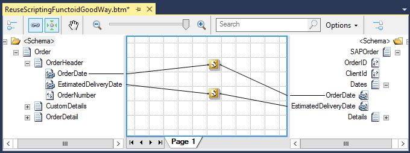

# BizTalk Mapper Tips and Tricks: How To Reuse Scripting Functoids with Inline C#

# Introduction
Inline scripts are convenient for custom code that you are unlikely to use elsewhere in your application or other maps. In addition to being convenient for one-time scripts, inline scripts are also useful for declaring global variables for use among a number of scripts and to use several times inside the same map.

In general, some of the main reasons to use Scripting Functoid are:
* Perform functions otherwise not available with built-in Functoids
* It also allows you to perform complex logic transformations that are impossible to make with built-in Functoids.
* To simplify the map, making it sometimes more easy to read, instead of using a complex Functoid chain
* Or simply to optimize the transformation rules

However, you need to have some precautions when using, or reusing the same, Custom Inline C# scripts inside the Scripting Functoid:
* Function Names Limitation
* Compiler limitations
* **Reusability**

# Building the Sample
You need to remember that when you have two or more Custom Inline C# scripts with the same Method statement (name of the method + method parameters), the compile will only take into consideration the first one linked in the map, **even if the others have a different code inside they are ignored by the compiler**.

When we use Custom Inline C# scripts the best way to implement reusability is to specify the body function in only one Scripting Functoid and the remaining ones specify only the function declaration, in this sample in the first Scripting Functoid will have the following code:

    
	public string FormatDate(string inputDate, string inputFormat, string outputFormat) 
	{ 
		System.DateTime date; 
		if (System.DateTime.TryParseExact(inputDate, inputFormat,  
			System.Globalization.CultureInfo.InvariantCulture,  
			System.Globalization.DateTimeStyles.AssumeLocal, out date)) 
		{ 
			return date.ToString(outputFormat); 
		} 
		return ""; 
	} 
    

And the second one only the following declaration:
    
    public string FormatDate(string inputDate, string inputFormat, string outputFormat)

    

# Read more about it
You can read more about this topic here: [BizTalk Mapper tips and tricks: How to reuse Scripting Functoids with Inline C# inside the same map
](https://blog.sandro-pereira.com/2016/01/16/biztalk-mapper-tips-and-tricks-how-to-reuse-scripting-functoids-with-inline-c-inside-the-same-map/)

# About Me
**Sandro Pereira** | [DevScope](http://www.devscope.net/) | MVP & MCTS BizTalk Server 2010 | [https://blog.sandro-pereira.com/](https://blog.sandro-pereira.com/) | [@sandro_asp](https://twitter.com/sandro_asp)

