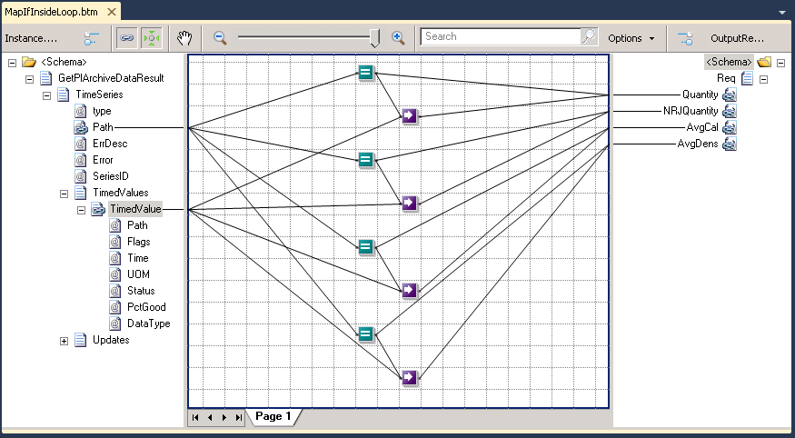
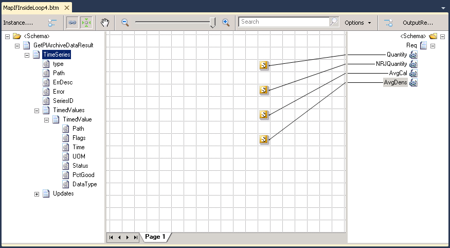

# How to map values from a repeating node into a single node using conditions

# Introduction
In this new mapping pattern I want to show you what’s the best way to map some values from a repeating node into a single node base in some conditions.

This exercise is actually from a question that I found on the forums: [Reg BizTalk Mapping](https://social.msdn.microsoft.com/Forums/en-US/799e7a3e-c3c3-4259-86c1-dc467820397c/reg-biztalk-mapping?forum=biztalkgeneral), which I found interesting.

Note: you can find all mapping logic of this exercise in the forum, however briefly we have a repeating node **TimeSeries** and based on Path attribute value of **TimeSeries** node we will map on some elements of the output message:
* If **Path** attribute  == **1** then assign the value of **TimedValue** to **Quantity**
* If **Path** attribute  == **2** then assign the value of **TimedValue** to **NRJQuantity**
* If **Path** attribute  == **3** then assign the value of **TimedValue** to **AvgCal**
* If **Path** attribute  == **4** then assign the value of **TimedValue** to **AvgDens**

# Building the Sample

## First Solution: Using only functoids (without custom XSLT)
To solve this mapping problem using this approach, for each element in the destination schema we need to drag:
* One Equal functoid and drag a link from the attribute “Path” in the source schema to this functoid, this will be the first input parameter in the functoid
  * And in the second parameter we need to put the number that we want to find, in this case: “1”.
* Drag a Value Mapping functoid to the grid
  * Drag a link from the Equal functoid to this Value Mapping functoid
  * Drag a link from the “TimedValue” element in the source element to the Value Mapping functoid
* Drag a link from the Equal functoid for the element in question in the destination schema, in this case “Quantity” element
*And finally we need to drag a link from the Value Mapping functoid to the respective element in the destination schema, in this case again “Quantity”.
* We need to repeat the above steps for all the element until we get the following map:

Limitations of this approach:
* **Lack of performance**

## Second Solution: Using Inline XSLT
In this second approach what we will do is take the XSLT code generated by the compiler and optimize it by removing all unnecessary cycles and put this code in a Scripting functoid.

To accomplish this, we need to:
* Drag Scripting functoid to the map grid
  * In the scripting type select “Inline XSLT” option
  * In the Inline script put the following code:
    
    <xsl:for-each select="TimeSeries"> 
         <xsl:if test="string(@Path) = '1' "> 
            <Quantity> 
              <xsl:value-of select="TimedValues/TimedValue/text()" /> 
            </Quantity> 
        </xsl:if> 
        <xsl:if test="string(@Path) = '2' "> 
            <NRJQuantity> 
              <xsl:value-of select="TimedValues/TimedValue/text()" /> 
            </NRJQuantity> 
        </xsl:if> 
        <xsl:if test="string(@Path) = '3' "> 
            <AvgCal> 
              <xsl:value-of select="TimedValues/TimedValue/text()" /> 
            </AvgCal> 
        </xsl:if> 
        <xsl:if test="string(@Path) = '4' "> 
            <AvgDens> 
              <xsl:value-of select="TimedValues/TimedValue/text()" /> 
            </AvgDens> 
        </xsl:if> 
    </xsl:for-each> 
    

* Finally drag a link from the Scripting functoid to one element in the destination schema, for example “NRJQuantity”

Limitations of this approach:
* May have some **lack of performance** if we work with large message because some unnecessary iterations in the cycle, however it is far more efficient than the first solution.
* Some **warnings** saying that some required field has no incoming link.
* Because we use scripting functoids we cannot read the entire map visually. We need to open the functoids and **read**, mainly, the XSLT code.

## Third Solution: Using Inline XSLT along with XPath queries
After analyzing all the advantages and disadvantages, for me this is the best approach to accomplish this type of mapping problem, because basically solves all limitations of previous solutions: it’s easy to create (only need basic knowledge of XSLT and XPath) and don’t have performance problems.

To accomplish this, we need to:
* Replace the code of the Scripting functoid, existing in the previous solution, by:
    
    <xsl:choose> 
	  <xsl:when test="count(//TimeSeries[@Path='1']) > 0"> 
		<Quantity> 
		  <xsl:value-of select="//TimeSeries[@Path='1']/TimedValues/TimedValue/text()" /> 
		</Quantity> 
	  </xsl:when> 
	</xsl:choose> 
	<xsl:choose> 
	  <xsl:when test="count(//TimeSeries[@Path='2']) > 0"> 
		<NRJQuantity> 
		  <xsl:value-of select="//TimeSeries[@Path='2']/TimedValues/TimedValue/text()" /> 
		</NRJQuantity> 
	  </xsl:when> 
	</xsl:choose> 
	<xsl:choose> 
	  <xsl:when test="count(//TimeSeries[@Path='3']) > 0"> 
		<AvgCal> 
		  <xsl:value-of select="//TimeSeries[@Path='3']/TimedValues/TimedValue/text()" /> 
		</AvgCal> 
	  </xsl:when> 
	</xsl:choose> 
	<xsl:choose> 
	  <xsl:when test="count(//TimeSeries[@Path='4']) > 0"> 
		<AvgDens> 
		  <xsl:value-of select="//TimeSeries[@Path='4']/TimedValues/TimedValue/text()" /> 
		</AvgDens> 
	  </xsl:when> 
    </xsl:choose>
    
	
Limitations of this approach:
* Because we use scripting functoids we cannot **read** the entire map visually. We need to open the functoids and read, mainly, the XSLT code.
* Need **basic knowledge of XSLT and XPath**
* Some **warnings** saying that some required field has no incoming link.

### Fourth Solution: Using Inline XSLT along with XPath queries (avoiding warnings)
So to avoid warnings saying that some required field has no incoming link we must split the XSLT code that we use in the last solution (Third Solution) in different blocks for each element in the destination schema

To accomplish this, we need to:
* Drag four Scripting functoid to the map grid and drag a link from each Scripting functoid to each element in the destination schema
* For each Scripting functoid:
  * In the scripting type select “Inline XSLT” option
  * In the Inline script put the code that corresponding to the element in the destination element.

Limitations of this approach:
* Because we use scripting functoids we cannot **read** the entire map visually. We need to open the functoids and read, mainly, the XSLT code.
* Need **basic knowledge of XSLT and XPath**

# Read more about it
You can read more about this topic here: [BizTalk Mapper Patterns: How to map values from a repeating node into a single node using conditions](https://blog.sandro-pereira.com/2012/12/13/biztalk-mapper-patterns-how-to-map-values-from-a-repeating-node-into-a-single-node-using-conditions/)

# About Me
**Sandro Pereira** | [DevScope](http://www.devscope.net/) | MVP & MCTS BizTalk Server 2010 | [https://blog.sandro-pereira.com/](https://blog.sandro-pereira.com/) | [@sandro_asp](https://twitter.com/sandro_asp)

