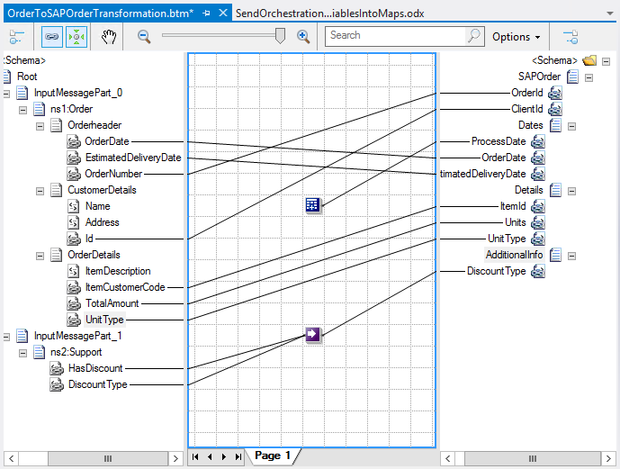

# BizTalk Mapper: How to Access Orchestration Variables from Maps

# Introduction
Basically this can be another example of [Content Enricher Pattern](https://github.com/sandroasp/BizTalk-Server-Learning-Path/tree/master/Working-with-Maps/Content-Enricher-Pattern), or you may need to pass orchestration variables into the map to make some transformation logic.

The question is how can we easily access orchestration variables from the maps?

And the answer is really simple: You don’t! You need to apply some kind of workaround to accomplish that and there are a couple of options a developer can have to accomplish that:
* Using a **custom functoid** (not recommended)
+ Using a **Helper Class** to stores values (should be avoid)
* Using a **Support Schema**
i
n any of the ways, the best way we will accomplished this is to use the same technic explain in the [Content Enricher Pattern](https://github.com/sandroasp/BizTalk-Server-Learning-Path/tree/master/Working-with-Maps/Content-Enricher-Pattern), i.e., using a support schema and pass multiple shemas to the map by using the “Transform Shape” inside the orchestration (setting multiple input messages under “Source Transform”).

# Building the sample

## Different approaches to solving the problem

### Using a custom functoid
One of the possible ways is to access the orchestrations variables through a Custom functoid you can find more about that here OrchestrationVariableRetrieverFunctoid.

However, I will advise you not to use this approach.

### Using a Helper Class to stores values
Using a .NET Helper Class to hold and to retrieve the data, this Class must be set as ThreadStatic. This will indicate that the value of a static field is unique for each thread.

### Using a Support Schema
The best solution is to use the same technic explain in the previous demo: (BizTalk Mapper Patterns: Working with Multiple input messages or joining messages (Content Enricher Pattern)), i.e., you need to create a Schema that can support this variables, and pass this support message along to your original message to the map (with two source schema's). Them you can easily use, combine or merge informations inside the map editor.

# Read more about it
You can read more about this topic here: [BizTalk Mapping Patterns and Best Practices book [Free] released](https://blog.sandro-pereira.com/2014/09/28/biztalk-mapping-patterns-and-best-practices-book-free-released/)

# About Me
**Sandro Pereira** | [DevScope](http://www.devscope.net/) | MVP & MCTS BizTalk Server 2010 | [https://blog.sandro-pereira.com/](https://blog.sandro-pereira.com/) | [@sandro_asp](https://twitter.com/sandro_asp)

