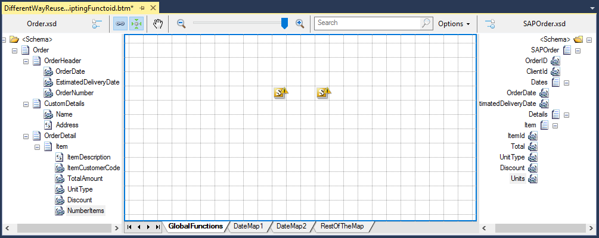

# BizTalk Mapper Tips and Tricks: How to create a Global Inline C# Function
# Introduction
The Scripting functoid enables you to use Inline Custom Script (C# .NET, JScript .NET, Visual Basic .NET, Extensible Stylesheet Language Transformations (XSLT) or XSLT Call Template) or call code from an external assembly at run time to perform operation otherwise not available through built-in Functoids. For example, using Scripting functoid with Inline C# is convenient for creating a custom operation that you are unlikely to use elsewhere in your application or other maps.

In general, some of the main reasons to use Scripting Functoid are:
* Perform functions otherwise not available with built-in Functoids
* It also allows you to perform complex logic transformations that are impossible to make with built-in Functoids.
* To simplify the map, making it sometimes more easy to read, instead of using a complex Functoid chain
* Or simply to optimize the transformation rules

# Building the Sample
After considering several approaches, keeping in mind that the purpose here is to maintain the use of Inline C# Scripting Functoids (not changing to approaches that use external Assemblies or Custom Functoids), I thought that the ideal would be to create a concept of Global Functions that I could use them anywhere within my map but, having a unique place with quick and easy access where I can maintain the code

This will solve the limitations of the previous approach:
* **Development**: from a developing perspective, even if this is a very straight forward task, trying to deciding where to put the function body code and the declarations can be a complicated task, all of them presenting challenges in terms of a maintenance perspective.
* **Maintainability**: From a maintenance perspective, if we need to change something within these inline codes, try to find in which Scripting Functoid the body code is declared can be time consuming task.

# Read more about it
You can read more about this topic here: [BizTalk Mapper tips and tricks: How to reuse Scripting Functoids with Inline C# inside the same map
](https://blog.sandro-pereira.com/2016/01/16/biztalk-mapper-tips-and-tricks-how-to-reuse-scripting-functoids-with-inline-c-inside-the-same-map/)

# About Me
**Sandro Pereira** | [DevScope](http://www.devscope.net/) | MVP & MCTS BizTalk Server 2010 | [https://blog.sandro-pereira.com/](https://blog.sandro-pereira.com/) | [@sandro_asp](https://twitter.com/sandro_asp)

