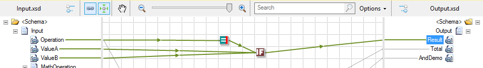

# BizTalk Mapper: How to create a custom If-Then-Else Functoid

# Introduction
Sometimes I ask myself: Why is so hard to make a simple If-Then-Else Functoid, or even so painful to do an If-Then-Else operation, using BizTalk mapper?

I don't mean to say that it is complicated, quite the opposite, is quite easy to make If…Then…Else statements using the Mapper. You can use **If...Then...Else** statements, to be completely correct, you can use something related to an **If...Then...Else** statements, to execute blocks of statements depending on the **Boolean** value of a condition by, normally, using:
* One **Logical Functoid** (Logical Existence, Logical String, Logical Numeric, Equal, Greater Than, Less Than and so on) to determine:
 * whether the Record, Field Element, or Field Attribute node that is linked to it exists or have a valid value in a particular input instance message
 * or if a condition match.
* One **Logical NOT Functoid** to negate the Logical Functoid
 * And two **Value Mapping Functoids** to returns the value that we want to linked based on the result of the condition

However, if you want to create a custom If-Then-Else Functoid, you will find that, out-of-the-box, it is impossible to create a custom functoid based on a Logical Functoid and the reason why this is true is that, all Logical Functoids available out-of-the-box with BizTalk only accept the following outputs connection types:
* ConnectionType.Element
* ConnectionType.FunctoidAssert
* ConnectionType.FunctoidNilValue
* ConnectionType.FunctoidKeyMatch
* ConnectionType.FunctoidTableLooping
* ConnectionType.FunctoidValueMapping
* ConnectionType.FunctoidScripter
* ConnectionType.FunctoidLogical
* ConnectionType.FunctoidString is not allowed in all the existing Logical Functoids. And that is the reason why you will find impossible to create a custom functoid based on a Logical functoid (don’t know the reason why Microsoft decide to implement this limitation)

# Building the Sample
What I want to archive is create a custom functoid that accepts 3 inputs:
* A Boolean - the result of a previous Logical Functoid (Logical Existence, Logical String, Logical Numeric, Equal, Greater Than, Less Than and so on)
* And two inputs

Were the custom Functoid will return a value from one of two input parameters based on a condition.
* If the condition (first input) is True, then the value of the second input parameter is returned;
* Otherwise the Third input is returned.

# Functoid Code

    
	namespace BizTalk.CustomAdvanced.Functoids 
    { 
        [Serializable] 
        public class IfThenElse : BaseFunctoid 
		{ 
			public IfThenElse() 
				: base() 
			{ 
				//ID for this functoid 
				this.ID = 10900; 
	 
				// resource assembly must be ProjectName.ResourceName if building with VS.Net 
				SetupResourceAssembly("BizTalk.Logical.Functoids.LogicalResources", Assembly.GetExecutingAssembly()); 
	 
				//Setup the Name, ToolTip, Help Description, and the Bitmap for this functoid 
				SetName("IDS_IFELSEFUNCTOID_NAME"); 
				SetTooltip("IDS_IFELSEFUNCTOID_TOOLTIP"); 
				SetDescription("IDS_IFELSEFUNCTOID_DESCRIPTION"); 
				SetBitmap("IDS_IFELSEFUNCTOID_BITMAP"); 
	 
				//category for this functoid. This functoid goes under the String Functoid Tab in the 
				this.Category = FunctoidCategory.String; 
	 
				// Set the limits for the number of input parameters. This example: 1 parameter 
				this.SetMinParams(3); 
				this.SetMaxParams(3); 
	 
				// Add one line of code as set out below for each input param. For multiple input params, each line would be identical. 
				this.AddInputConnectionType(ConnectionType.AllExceptRecord); //first input 
				this.AddInputConnectionType(ConnectionType.AllExceptRecord); //Second input 
				this.AddInputConnectionType(ConnectionType.AllExceptRecord); //Third input 
	 
				// The functoid output can go to any node type. 
				this.OutputConnectionType = ConnectionType.AllExceptRecord; 
	 
				SetScriptBuffer(ScriptType.CSharp, this.GetCSharpBuffer()); 
				HasSideEffects = false; 
			} 
	 
			private string GetCSharpBuffer() 
			{ 
				StringBuilder builder = new StringBuilder(); 
				builder.Append("public string IfThenElseOperation(string condition, string trueValue, string falseValue)\n"); 
				builder.Append("{\n"); 
				builder.Append("\tif (System.Convert.ToBoolean(condition))\n"); 
				builder.Append("\t\treturn trueValue;\n"); 
				builder.Append("\treturn falseValue;\n"); 
				builder.Append("}\n"); 
				return builder.ToString(); 
			} 
		} 
	}
    

# How did I solve (or I overcame) this challenger? Read more about it
You can read more about this topic here: [Why is so hard to make a simple If-Then-Else Functoid? … well, not anymore!
](https://blog.sandro-pereira.com/2016/02/10/why-is-so-hard-to-make-a-simple-if-then-else-functoid-well-not-anymore/)

# About Me
**Sandro Pereira** | [DevScope](http://www.devscope.net/) | MVP & MCTS BizTalk Server 2010 | [https://blog.sandro-pereira.com/](https://blog.sandro-pereira.com/) | [@sandro_asp](https://twitter.com/sandro_asp)

