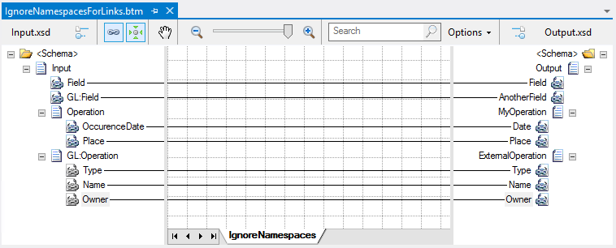

# BizTalk Mapper: When to use the Ignore Namespaces for Links property

# Introduction
The official documentation states that you should use the “Ignore Namespaces for Links” property to indicate whether the links stored in the map contain any references to the namespaces used in the schemas. And that this property allows two Values:
* True: Specifies that the links in the map do not contain any references to the namespaces used in the source or destination schemas, thereby protecting the links from changes made to those schema namespaces outside the map. (Default Value)
* False: Specifies that the links in the map contain references to the namespaces used in the source and destination schemas, thereby making the links sensitive to changes made to those schema namespaces outside the map.
 

The only situation in which you should set the value of this property to “False” is when either your source or destination schema contains two nodes on the same level or sibling nodes with the exact same name but with different namespaces. In such cases, because the Mapper cannot determine which of the nodes to use for the link, the namespace designator in links is necessary to find the correct source or destination node for the link in the produced XSLT.

# Read more about it
You can read more about this topic here: [BizTalk Mapping Patterns and Best Practices book [Free] released](https://blog.sandro-pereira.com/2014/09/28/biztalk-mapping-patterns-and-best-practices-book-free-released/)

# About Me
**Sandro Pereira** | [DevScope](http://www.devscope.net/) | MVP & MCTS BizTalk Server 2010 | [https://blog.sandro-pereira.com/](https://blog.sandro-pereira.com/) | [@sandro_asp](https://twitter.com/sandro_asp)

