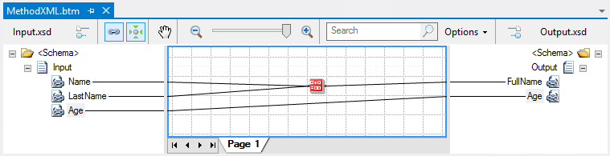

# BizTalk Mapper: Method (Grid Property) explained

# Introduction
The official documentation states that you should use the Method property to specify the overall method for producing the output of the transformation. This property allows three Values:
* xml: The mapper will produce the output of the transformation as XML. (Default Value)
* html: The mapper will produce the output of the transformation as HTML.
* Text: The mapper will produce the output of the transformation as text.

If we look at this simple scenario were we 3 elements in the source schema that we need to map and transform in two element in the destination schema:

With the method property set to **xml** the output instance will be a valid XML.

With the method property set to **html** although defined to e HTML the output instance will look exactly as if we had defined as XML.

With the method property set to **text** then we have a completely different behavior and the output instance will be a txt will all the element.

Unfortunately I cannot find any practical scenario where we really have to change this property.
 
# Read more about it
You can read more about this topic here: [BizTalk Mapping Patterns and Best Practices book [Free] released](https://blog.sandro-pereira.com/2014/09/28/biztalk-mapping-patterns-and-best-practices-book-free-released/)

# About Me
**Sandro Pereira** | [DevScope](http://www.devscope.net/) | MVP & MCTS BizTalk Server 2010 | [https://blog.sandro-pereira.com/](https://blog.sandro-pereira.com/) | [@sandro_asp](https://twitter.com/sandro_asp)

