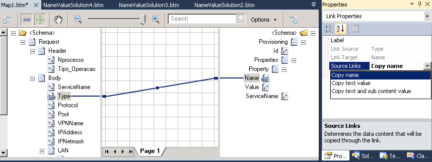
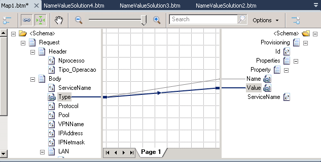
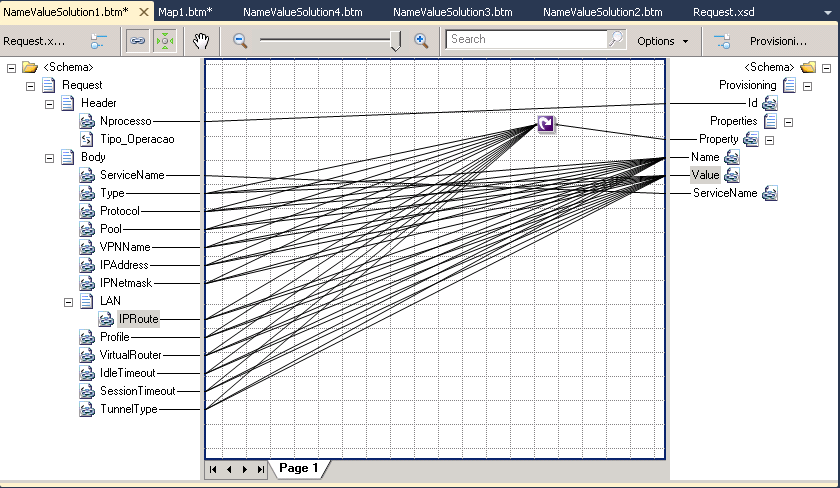
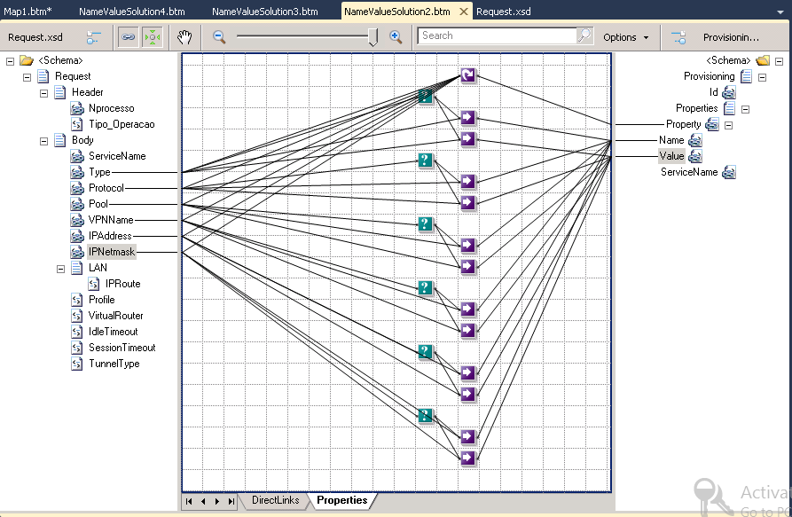
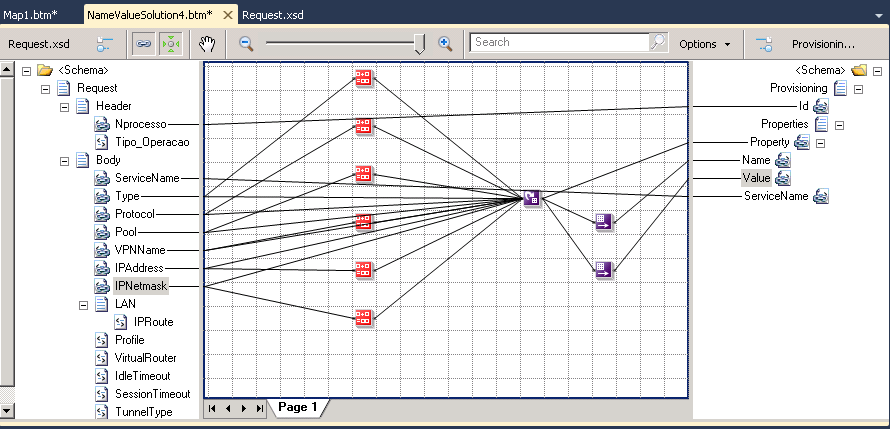

# BizTalk Mapper Patterns: Name-Value Transformation Pattern - How to Map Hierarchical Schema to a Name Value Pair

# Introduction
In this new mapping pattern I want to show you how can you transform an hierarchical schema into a Name/Value Pair record.

The first thing we need to know is how I can read the name of the element from the source schema. By default when we drag a link from the source to the destination schema, the value of the element is mapped in the destination schema, but we can change this behavior in the link properties by choosing “Copy name” in the “Source Links” property:

So to reach our goal we need to link for the source to the destination schema:
* The link to the “Name” element set with “Copy name” in the “Source Links” property
* And the link to the “Value” element set with “Copy text value” (the default value) in the “Source Links” property

# Building the Sample

## First Solution: Using only Links

Limitations of this approach:
* If the source schema has many elements it takes much work to do this kind of mapping and because we need many links to do this simple task it may become **difficult to read** the map.
* We're not validate the existence of optional elements, which causes **too many warnings**
* A new element in the source schema requires that we have to **rectify the mapping**

## Second Solution: Using only Links and validate the existence of optional elements

Limitations of this approach:
* If the source schema has many elements it takes much work to do this kind of mapping and because we need many links and functoids to do this simple task it may become **difficult to read** the map.
* A new element in the source schema requires that we have to **rectify the mapping**

## Third Solution: Using Inline XSLT
This is my favorite approach and why? Because basically solves all limitations of previous solutions: Too many work, too many links and functoids and most important can be complete dynamic, i.e., if another element is added to the source schema I don’t need to fix the mapping!

Limitations of this approach:
* Because we use scripting functoids we cannot read the entire map visually. We need to open the functoids and **read**, mainly, the XSLT code.

## Fourth Solution: Using Table Looping functoid

Limitations of this approach:
* If the source schema has many elements it takes much work to do this kind of mapping and because we need many links and functoids to do this simple task it may become **difficult to read** the map.
* We're not validate the existence of optional elements, which causes **too many warnings**.
* A new element in the source schema requires that we have to **rectify the mapping**

# Read more about it
You can read more about this topic here: [BizTalk Mapper Patterns: How to Map Hierarchical Schema to a Name Value Pair](https://blog.sandro-pereira.com/2012/10/28/biztalk-mapper-patterns-how-to-map-hierarchical-schema-to-a-name-value-pair/)

# About Me
**Sandro Pereira** | [DevScope](http://www.devscope.net/) | MVP & MCTS BizTalk Server 2010 | [https://blog.sandro-pereira.com/](https://blog.sandro-pereira.com/) | [@sandro_asp](https://twitter.com/sandro_asp)

