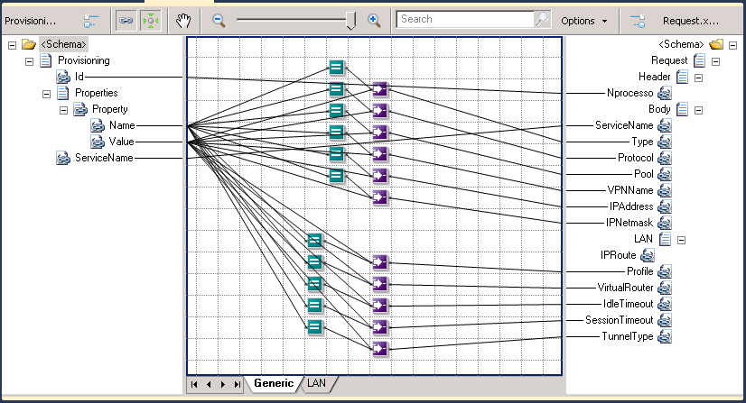
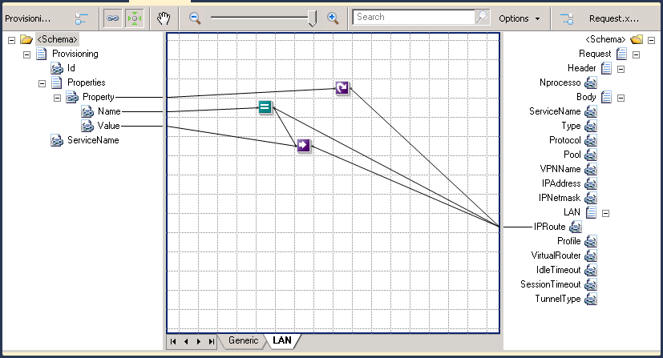
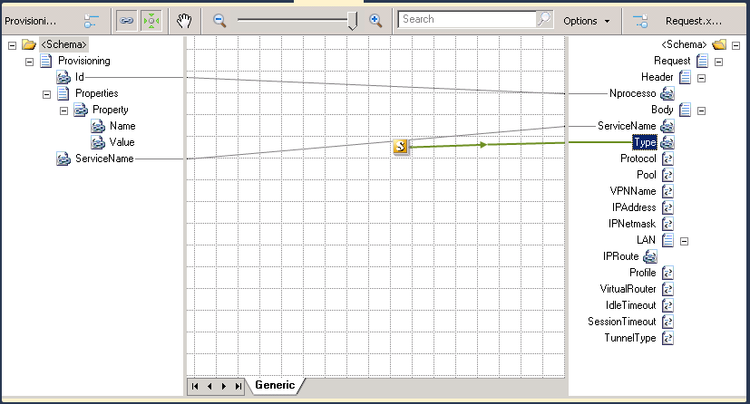

# BizTalk Mapper Patterns: Name-Value Transformation Pattern - How to Map Name Value Pair to a Hierarchical Schema

# Introduction
In this new mapping pattern, I want to show you how can you transform a Name/Value Pair record into a hierarchical schema.

As a developer, the first approach we think is to try to solve this mapping problem using only the available functoids, i.e. without custom XSLT. I quickly discarded this option and you will see why.

# Building the Sample

## First Solution: Using only functoids (without custom XSLT)
To solve this mapping problem using this approach, for each element in the destination schema we need to drag:
* One Equal functoid and drag a link from the element “Name” in the source schema to this functoid, this will be the first condition in the functoid
  * And in the second condition we need to put the element name of the destination schema that we try to map, for example “Type”.
* Drag a Value Mapping (Flattening) functoid to the grid
  * Drag a link from the Equal functoid to this Value Mapping (Flattening) functoid
  * Drag a link from the “Value” element in the source element to the Value Mapping (Flattening) functoid
  * And finally we need to drag a link from the Value Mapping (Flattening) functoid to the respective element in the destination schema, in this case “Type” element as you can see in the picture bellow.
* We need to repeat the above steps for all the element except the “IPRoute” element, until we get the following map:

* Because “IPRoute” element is a repeating element, we need to take a different approach:
  * We need to drag a Looping functoid and drag a link from “Property” record in the source schema to this functoid and then drag a link from the Looping functoid to the “IPRoute” element in the destination schema
  * Then we need to make the exact same steps described earlier (Equal functoid and Value Mapping (Flattening) functoid)
  * But because we want to create the “IPRoute” element ONLY if the name is equal to “IPRoute”, then we need to drag a link from the Equal functoid to the “IPRoute” element in the destination schema

If we analyze the XSLT regenerated by the BizTalk mapping engine, we will see that for each element in the destination schema it will be one-for-each element! 

This means that if we have 50 occurrences of "Property" record, each filled with the elements Name and Value, we will have 50 iterations for each element that we want to map to the destination schema… in this scenario we have 12 elements, this means 600 iterations and will be worse if we are working with large maps or with high amounts of "Property" record occurrence.

Limitations of this approach:
* **Lack of performance**
* If the destination schema has many elements it takes to much work to do this kind of mapping and because we need many links and functoids to do this simple task it may become difficult to **read** the map.
* If we add a new element in the destination schema, it requires that we have to **rectify the mapping**
 
## Second Solution: Dynamic mapping using Inline XSLT
I soon realized that if I wanted a really good and effective solution, I would have to use custom XSLT.

And the second approach that I thought was trying to make a dynamic mapping, similarly to the third solution that I have accomplished in the "BizTalk Mapper Patterns: How to Map Hierarchical Schema to a Name Value Pair" problem

To accomplish this, we need to:
* Drag Scripting functoid to the map grid
* In the scripting type select “Inline XSLT” option
* In the Inline script put the following code:

    
    <xsl:for-each select="/s0:Provisioning/Properties/Property"> 
		<xsl:if test="Name/text()!='IPRoute'"> 
			<xsl:element name="{normalize-space(*[local-name()='Name']/text())}"> 
				<xsl:value-of select="Value/text()"/> 
			</xsl:element> 
		</xsl:if> 
	</xsl:for-each> 
    

* Finally, drag a link from the Scripting functoid to the “Type” element in the destination schema:

This looked like be my favorite approach because is completely dynamic. If another element was added to the destination schema I didn't need to fix the mapping!

But unfortunately, this approach has several serious limitations.

Limitations of this approach:
* The script only works well if all the elements contained in the "Properties" record are coming filled in the correct order of the elements in the destination schema.
* Don’t work with nested records (or sub-records), if you notice in the script I ignore all “IPRoute” names

I could probably find other limitations but for me, these two are enough to discard this approach.

## Third Solution: Using Inline XSLT along with XPath queries
After analyzing all the advantages and disadvantages, for me this is the best (only) approach to accomplish this type of mapping problem. Again, because basically solves all limitations of previous solutions: it’s easy to create (only need basic knowledge of XSLT and XPath) and don’t have performance problems.

To accomplish this, we need to:
* Replace the code of the Scripting functoid, existing in the previous solution, by:

    
    <xsl:choose> 
		<xsl:when test="count(//Properties/Property[Name='Type']) > 0"> 
			<Type> 
				<xsl:value-of select="//Properties/Property[Name='Type']/Value/text()" /> 
			</Type> 
		</xsl:when> 
	</xsl:choose> 
	<xsl:choose> 
		<xsl:when test="count(//Properties/Property[Name='Protocol']) > 0"> 
			<Protocol> 
				<xsl:value-of select="//Properties/Property[Name='Protocol']/Value/text()" /> 
			</Protocol> 
		</xsl:when> 
	</xsl:choose> 
	<xsl:choose> 
	  <xsl:when test="count(//Properties/Property[Name='Pool']) > 0"> 
		<Pool> 
		  <xsl:value-of select="//Properties/Property[Name='Pool']/Value/text()" /> 
		</Pool> 
	  </xsl:when> 
	</xsl:choose> 
	<xsl:choose> 
	  <xsl:when test="count(//Properties/Property[Name='VPNName']) > 0"> 
		<VPNName> 
		  <xsl:value-of select="//Properties/Property[Name='VPNName']/Value/text()" /> 
		</VPNName> 
	  </xsl:when> 
	</xsl:choose> 
	<xsl:choose> 
	  <xsl:when test="count(//Properties/Property[Name='IPAddress']) > 0"> 
		<IPAddress> 
		  <xsl:value-of select="//Properties/Property[Name='IPAddress']/Value/text()" /> 
		</IPAddress> 
	  </xsl:when> 
	</xsl:choose> 
	<xsl:choose> 
	  <xsl:when test="count(//Properties/Property[Name='IPNetmask']) > 0"> 
		<IPNetmask> 
		  <xsl:value-of select="//Properties/Property[Name='IPNetmask']/Value/text()" /> 
		</IPNetmask> 
	  </xsl:when> 
	</xsl:choose> 
	<xsl:choose> 
	  <xsl:when test="count(//Properties/Property[Name='IPRoute']) > 0"> 
		<LAN> 
		  <xsl:for-each select="Properties/Property[Name='IPRoute']"> 
			<IPRoute> 
			  <xsl:value-of select="./Value/text()" /> 
			</IPRoute> 
		  </xsl:for-each> 
		</LAN> 
	  </xsl:when> 
	</xsl:choose> 
	<xsl:choose> 
	  <xsl:when test="count(//Properties/Property[Name='VirtualRouter']) > 0"> 
		<VirtualRouter> 
		  <xsl:value-of select="//Properties/Property[Name='VirtualRouter']/Value/text()" /> 
		</VirtualRouter> 
	  </xsl:when> 
	</xsl:choose> 
	<xsl:choose> 
	  <xsl:when test="count(//Properties/Property[Name='IdleTimeout']) > 0"> 
		<IdleTimeout> 
		  <xsl:value-of select="//Properties/Property[Name='IdleTimeout']/Value/text()" /> 
		</IdleTimeout> 
	  </xsl:when> 
	</xsl:choose> 
	<xsl:choose> 
	  <xsl:when test="count(//Properties/Property[Name='SessionTimeout']) > 0"> 
		<SessionTimeout> 
		  <xsl:value-of select="//Properties/Property[Name='SessionTimeout']/Value/text()" /> 
		</SessionTimeout> 
	  </xsl:when> 
	</xsl:choose> 
	<xsl:choose> 
	  <xsl:when test="count(//Properties/Property[Name='TunnelType']) > 0"> 
		<TunnelType> 
		  <xsl:value-of select="//Properties/Property[Name='TunnelType']/Value/text()" /> 
		</TunnelType> 
	  </xsl:when> 
	</xsl:choose>
    

Limitations of this approach:
* Because we use scripting functoids we cannot read the entire map visually. We need to open the functoids and read, mainly, the XSLT code.
* need basic knowledge of XSLT and XPath
* If we add a new element in the destination schema, it requires that we have to rectify the mapping
 
# Read more about it
You can read more about this topic here: [BizTalk Mapper Patterns: How to Map Name Value Pair to a Hierarchical Schema](https://blog.sandro-pereira.com/2012/11/08/biztalk-mapper-patterns-how-to-map-name-value-pair-to-a-hierarchical-schema/)

# About Me
**Sandro Pereira** | [DevScope](http://www.devscope.net/) | MVP & MCTS BizTalk Server 2010 | [https://blog.sandro-pereira.com/](https://blog.sandro-pereira.com/) | [@sandro_asp](https://twitter.com/sandro_asp)

