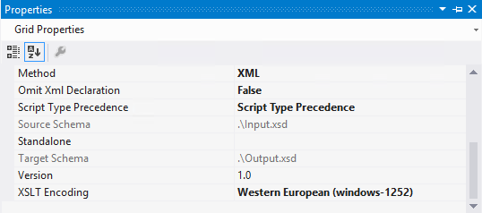

# BizTalk Mapper: Omit XML Declaration (Grid Property) explained

# Introduction
The official documentation states that you should use the Omit XML Declaration property to specify whether the transformation output should include an XML declaration. This property allows two values:
* **False**: Specifies that the output of the transformation should include an XML declaration.
* **True**: Specifies that the output of the transformation should not include an XML declaration. This is the Default Value.

And if we test our map we will see that this changes have effect and produce the transformation output with a XML Declaration according to the encoding specified.

    
	<?xml version="1.0" encoding="Windows-1252"?> 
	<ns0:Output xmlns:ns0="http://OmitXMLDeclaration.Output"> 
	  <FullName>Sandro Pereira</FullName> 
	</ns0:Output> 
	
However this options has no kind of impact at runtime. Let’s imagine the following scenario where we have an Outbound map, with the Omit Xml Declaration property as false, specify in a send port that writes the XML file to our file system.

If we apply the default XML Transmit pipeline the output will have the encoded as UTF-16:

    
    <?xml version="1.0" encoding="utf-16"?> 
	<ns0:Input xmlns:ns0="http://OmitXMLDeclaration.Input"> 
	  <Name>Sandro</Name> 
	  <LastName>Pereira</LastName> 
	</ns0:Input>  
    
 
At Runtime, this property seems to have no impact. As a result, I draw the conclusion that this property is obsolete.

# Read more about it
You can read more about this topic here: [BizTalk Mapping Patterns and Best Practices book [Free] released](https://blog.sandro-pereira.com/2014/09/28/biztalk-mapping-patterns-and-best-practices-book-free-released/)

# About Me
**Sandro Pereira** | [DevScope](http://www.devscope.net/) | MVP & MCTS BizTalk Server 2010 | [https://blog.sandro-pereira.com/](https://blog.sandro-pereira.com/) | [@sandro_asp](https://twitter.com/sandro_asp)

