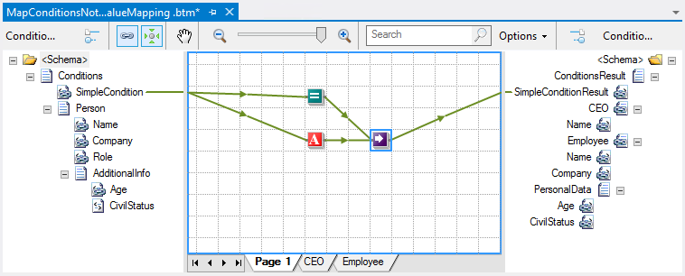

# BizTalk Mapper: OptimizeValueMapping attribute of the mapsource element

# Introduction
You can modify certain default behaviors of BizTalk Mapper by modifying attributes of the mapsource element directly in a map source (.btm) file.

This attribute will decide whether or not the BizTalk Mapper automatically optimize the Value Mapping Functoid Code Generation.

When the Mapper generates XSLT code to call the Value Mapping functoid, a variable is used to store the result. You can use the **OptimizeValueMapping** flag to optimize the Value Mapping functoid so that a variable is generated only when the *<xsl:if>* statement evaluates to **True**.

The Mapper does this optimization automatically if you set the **OptimizeValueMapping** attribute of the **mapsource** element in the map source (.btm) file to **Yes**.

This behavior is particularly true if we have previous actions (transformations rules) that are linked to the **Value Mapping functoid**, nevertheless if don’t have previous actions (transformations rules) linked to the Functoid.
 
# Read more about it
You can read more about this topic here: [BizTalk Mapping Patterns and Best Practices book [Free] released](https://blog.sandro-pereira.com/2014/09/28/biztalk-mapping-patterns-and-best-practices-book-free-released/)

# About Me
**Sandro Pereira** | [DevScope](http://www.devscope.net/) | MVP & MCTS BizTalk Server 2010 | [https://blog.sandro-pereira.com/](https://blog.sandro-pereira.com/) | [@sandro_asp](https://twitter.com/sandro_asp)

