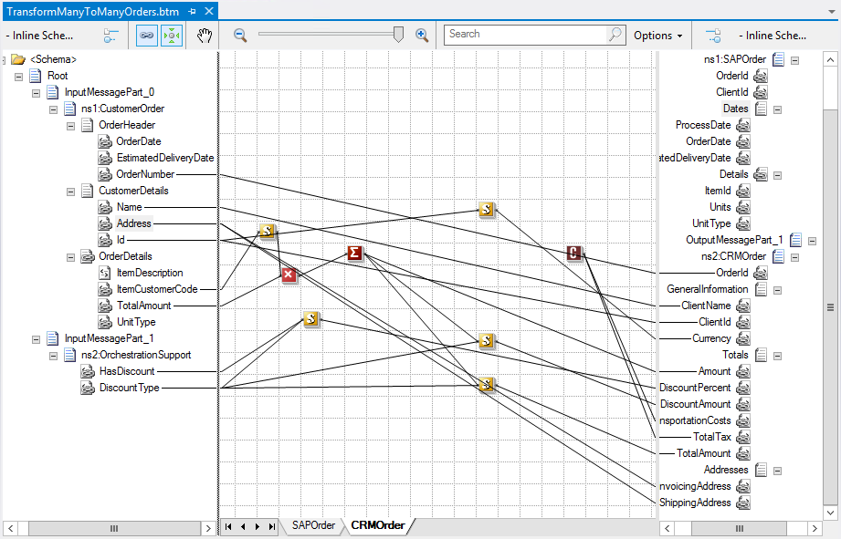

# BizTalk Mapper Patterns: Splitter Pattern

aka BizTalk Mapper Patterns: Working With Multiple Output Messages or Splitting Messages

# Introduction
A common integration problem you might come across is the need to integrate information coming from a system into several system that may require different information or less information over what is sent. So we basically want to split the original information into two different formats to be sent to our internal systems.

We can accomplish this by using:
* Two different maps.
* Or using one map with one or more source schema and two or more destination schemas

In this demo we will explain how to create a map with multiple output messages.

# Building the sample

First you have to take two things into consideration:
* This type of mapping is only allowed inside the Orchestration.
* And you cannot create this from Visual Studio as a normal map item, this type of map can only be created from “Transform Shape” inside the orchestration when you are developing this orchestration in the Visual Studio.

## Mapping One-to-Many
In this demo we will need to send a Customer Order receive from in our system to two internal systems:
* Part of the information, specially the client detail information, must be send to the CRM System
* And other part of the information, the order detail information, must be send to SAP System

## Mapping Many-to-Many
This is the same demo explain earlier, but in this scenario we are gathering from one internal system information about the discount that should be apply or not in this client order that we need to send to our map.

### Different approaches to solve the problem

#### First Solution: Using Functoids and Custom C# code
Again as a developer I like to try solving this mapping problem using the available functoids whenever I can, i.e. avoiding custom XSLT or custom C# code.

#### Second Solution: Replacing the if-else-statement for a custom C# code
To improve the last approach we need to simplify the if-else-statement by replacing for one Scripting Functoid with C# code inside.

#### Third Solution: Using a global variable
We still have lack of performance issues in large messages. So how can we improve this solution without having to turn to custom XSLT?
 
# Read more about it
You can read more about this topic here: [BizTalk Mapping Patterns and Best Practices book [Free] released](https://blog.sandro-pereira.com/2014/09/28/biztalk-mapping-patterns-and-best-practices-book-free-released/)

# About Me
**Sandro Pereira** | [DevScope](http://www.devscope.net/) | MVP & MCTS BizTalk Server 2010 | [https://blog.sandro-pereira.com/](https://blog.sandro-pereira.com/) | [@sandro_asp](https://twitter.com/sandro_asp)

