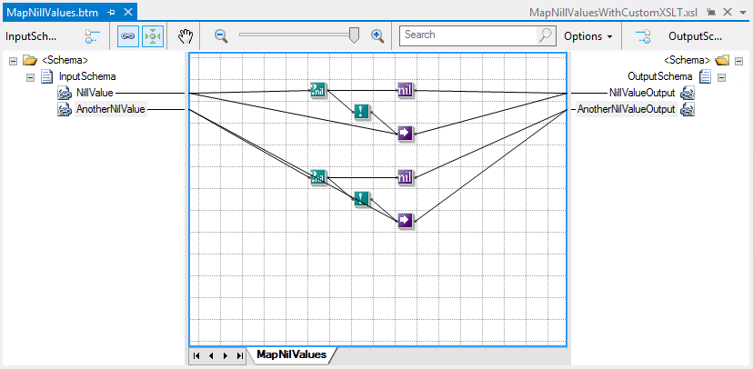

# BizTalk Mapper: Working With Nillable Values (xsi:nil="true")

# Introduction
Basically there are two properties inside the schema element decides whether an element can be absent from the document: **Min Occurs** and **Nillable**.

If **Min Occurs** property is set 0 then that element can be absent from the XML message but if it is set to 1 it has to be present though its value can be empty. This is useful to reduce the size of the document if only not all the elements are mandatory to end systems.

In other hand, if the **Nillable** property of the element is set to true, this will indicate that the value of an element in the document may be null. This NULL values will be expressed with xsi:nil = true attribute in the element, ex:
    
    <IntExist xsi:nil="true" />
    
An element with the attribute xsi:nil = true explicitly means that the value is unavailable or unknown at that moment and sometimes the end system explicitly requires to be notified that the value of the element is NULL so that they can take appropriate action.

# Building the Sample
In this sample scenario, we will have 2 mandatory elements that can be nillable that we need to map to the destination schema. In this scenario, all the destination elements are also mandatory and we need to fill them with a valid value or specify the nillable property as true: so if the element exists we need to map the correct source value otherwise we need to set the destination element as nillable.

 
# Read more about it
You can read more about this topic here: [BizTalk Mapper: Working With Nillable Values (xsi:nil=”true”)](https://blog.sandro-pereira.com/2014/06/12/biztalk-mapper-working-with-nillable-values-xsiniltrue/)

# About Me
**Sandro Pereira** | [DevScope](http://www.devscope.net/) | MVP & MCTS BizTalk Server 2010 | [https://blog.sandro-pereira.com/](https://blog.sandro-pereira.com/) | [@sandro_asp](https://twitter.com/sandro_asp)

