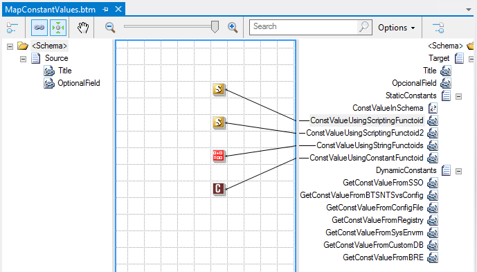
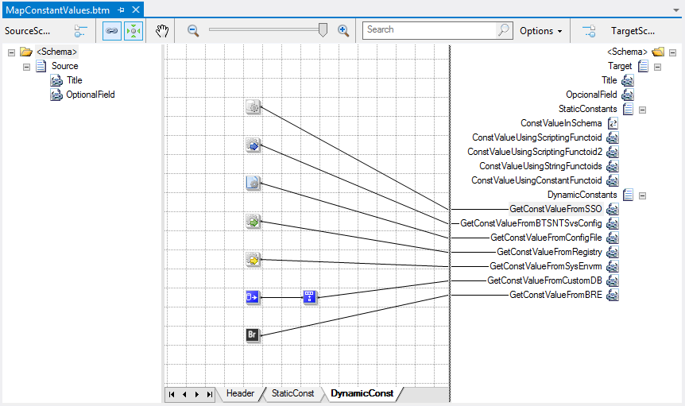

# BizTalk Mapper: Working with Constant Values inside maps

# Introduction
Sometimes we would like to use constant values within a BizTalk map to suppress certain lack of “static” information in the source message which are required in the final message or to supply in elements that don’t change (or rarely change), such as a billing address or a company name.

The best use of constant mapping depends on the situation and requirements you are developing against.

There are a couple of options a developer can have when comes to using constant values inside the maps. These options can be divided into two categories:
* **Hard code value** inside BizTalk maps: might lead to maintenance overhead and serviceability issues
* **Dynamic constant values** inside BizTalk maps: obviously leads to more weight on performance.

# Different approaches to solve the problem
 
## Hard code value inside BizTalk maps

### Using Schema Properties
The easy way is using the schema properties to set a default constant value to fields and elements.

### Using Functoids
The other option is using an existent functoid to set constant value to fields and elements, for example: String Constant functoid.

## Dynamic constant values inside BizTalk maps

### Using Configuration Files
Configuration files enable you to store application information dynamically.

### BTSNTSvc.exe.config file
This is probably one of the easiest places to store the configuration information.

### Custom Configuration File
A custom configuration file (.config) can be option that you can use to store application configuration data.

### Using the Machine
Using the machine operating system resources to store application information.

### Windows Registry
Another valid option to store the application configuration values is the Windows Registry.

### Global System Environment Variables
One of the most unusual places, but still a valid solution is the Global System Environment Variables on the Windows.

### Using Databases
A database would be a better option that you can use to store application configuration data

### Business Rule Engine
Business Rules Engine (BRE) is a run-time inference engine that can link highly readable, declarative, semantically rich rules to any business objects (.NET components), XML documents, or database tables.

### Enterprise Single Sign-On Database
One of popular and easy options of retrieving application configuration data is using Enterprise Single Sign-On (SSO).

### Custom Database
Another common place to store application configuration data

# Read more about it
You can read more about this topic here: [BizTalk Mapper: Working With Nillable Values (xsi:nil=”true”)](https://blog.sandro-pereira.com/2014/06/12/biztalk-mapper-working-with-nillable-values-xsiniltrue/)

# About Me
**Sandro Pereira** | [DevScope](http://www.devscope.net/) | MVP & MCTS BizTalk Server 2010 | [https://blog.sandro-pereira.com/](https://blog.sandro-pereira.com/) | [@sandro_asp](https://twitter.com/sandro_asp)

