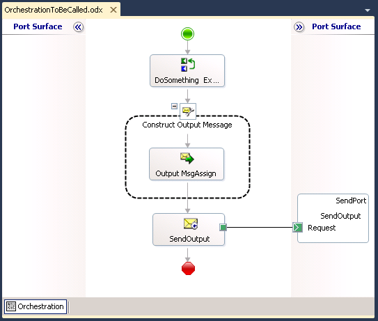
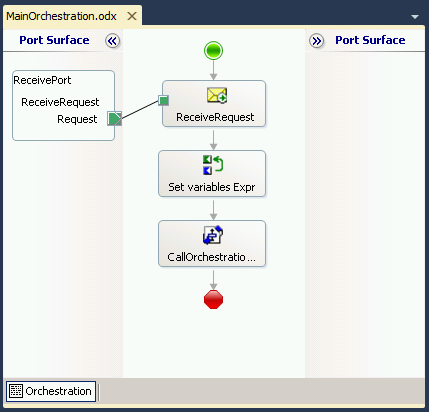

# BizTalk Server: How to call a SQL Stored procedure without inputs

# Introduction
In the past, I developed a demo on [How to Call Orchestration from another project or from another BizTalk Application](https://blog.sandro-pereira.com/2009/07/24/biztalk-orchestration-call-orchestration-from-another-project-or-from-another-biztalk-application/) that you can read here and download the source code.

This demo was composed by one Visual Studio Solution with two different projects:
* Project1
  * Orch1
  * Schema1
* Project2
  * Orch2

However, there were a few questions about how we can accomplish that using two different solutions… well is the exact same process, but to help clarify this topic and to better help the community members that placed the questions I decide to create a different demo.

In this demo we will create two Visual Studio Solution:
* **CallExternalOrchestrationCommonSolution** with a common orchestration that will be called from others orchestrations
  * This will be deployed to a BizTalk Application called **CallExternalOrchestration.Common**
* **CallExternalOrchestrationMainSolution** with the main Orchestration that will call the common Orchestration using the **Call Orchestration** shape.
  * This will be deployed to a BizTalk Application called “CallExternalOrchestration”

# Building the Sample

## CallExternalOrchestrationCommonSolution
This project contains an orchestration that will receive two input string (however you can define other types of input like a message or other types) and will construct a message that will be sent to a folder on the file system.

## CallExternalOrchestrationMainSolution
The second project basically contains one orchestration that will receive an input message from a folder on the file system and will call a common (or external) orchestration.

# Read more about it
You can read more about this topic here: [BizTalk Training – Orchestrations – How to Call Orchestrations developed in a different Visual Studio Solution](https://blog.sandro-pereira.com/2013/06/15/biztalk-training-orchestrations-how-to-call-orchestrations-developed-in-a-different-visual-studio-solution/)

# About Me
**Sandro Pereira** | [DevScope](http://www.devscope.net/) | MVP & MCTS BizTalk Server 2010 | [https://blog.sandro-pereira.com/](https://blog.sandro-pereira.com/) | [@sandro_asp](https://twitter.com/sandro_asp)

