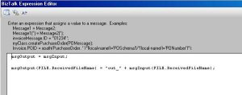
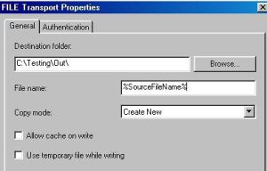

# Customize filename dynamically inside BizTalk Orchestration

# Introduction
This is a basic step, to accomplish this you have to define the message context property of the output message.

The message context is a container for various properties that are used by BizTalk Server when processing the document. Each property in the Message Context is composed of three things, a name, a namespace, and a value.

# Building the Sample
In orchestration:
* Double click in Message Assignment shape (of the output message) and type:

    
    msgOutput(FILE.ReceivedFileName) = “out_” + msgInput(FILE.ReceivedFileName);
    

## Sample Configuration

In BizTalk Administration Console:
* Set Send port:
  * Port type: Static One-Way
  * Transport: FILE
  * DestinationFolder: (To OUT folder)
  * FILENAME: %SourceFileName%
  * Send pipeline: XMLTransmit
  

Test application:
* Create two folders (IN and OUT), configure the receive location to get from IN folder, and the send port send to OUT folder

# Read more about it
You can read more about this topic here: [BizTalk Training – Customize filename dynamically inside Orchestration](https://blog.sandro-pereira.com/2009/10/23/biztalk-training-customize-filename-dynamically-inside-orchestration/)

# About Me
**Sandro Pereira** | [DevScope](http://www.devscope.net/) | MVP & MCTS BizTalk Server 2010 | [https://blog.sandro-pereira.com/](https://blog.sandro-pereira.com/) | [@sandro_asp](https://twitter.com/sandro_asp)

