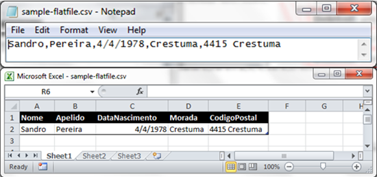
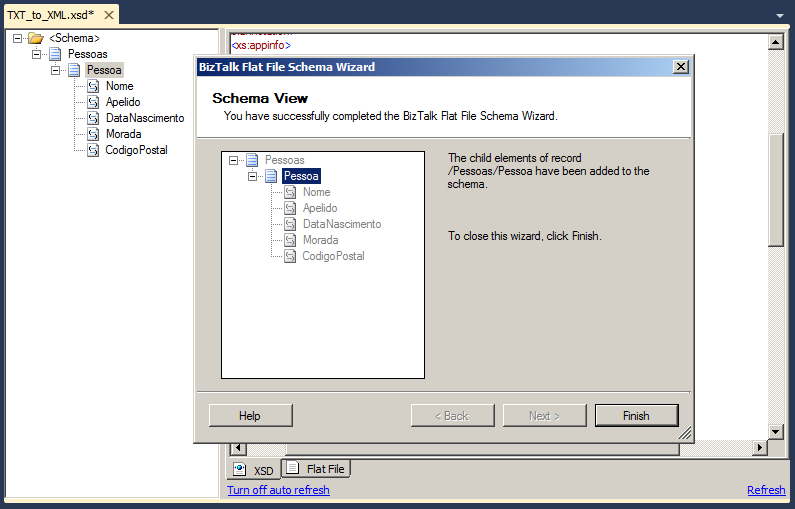

# Flat Files Schemas: Transform text files (Flat Files) into XML

# Introduction
Transformations are one of the most common components in the integration processes. They act as essential translators in the decoupling between the different systems to connect. This article aims to help you understand the process of transforming a text file (also called Flat Files) in an XML document using BizTalk Server Flat File Schemas.

Normally we associate the transformations of documents to BizTalk maps, but the reality is that there are two types of transformations: structure transformation (semantics) and representation transformation (syntax). These latest occurs typically at receiving or sent ports of BizTalk Server,

This sample intends to be an introductory note for whom is taking the first steps in this technology.

One of the most ancient and common standards for message representation is to use text files (Flat Files) like: CSV (Comma Separated Values) or TXT files, many of them custom-made for their systems. However over the time, XML became the standard message format because of its widespread use by major corporations and open source development efforts. However do not be fooled and think that these kinds of message are outdated and rarely used, a good example is EDI messages, which is used extensively by large companies, so it is often necessary to transform text files into XML and vice versa.

While tools like Excel can help us interpret such files, this type of process is always iterative and requires few user tips so that software can determine where is need to separate the fields/columns as well the data type of each field. But for a system integration (Enterprise Application Integration) like BizTalk Server, you must reduce any ambiguity, so that these kind of operations can be performed thousands of times with confidence and without having recourse to a manual operator.

We can characterize two types of transformations existing in BizTalk:
* **Semantic Transformations**: This type of transformation usually occurs only in BizTalk maps. Here the document maintains the same syntax that is represented (XML), but changes its semantics (data content). This type of transformation are typically one-way, since that when we added and aggregate small parts of the information, that compose the document into another differently document, we may miss important details for its reconstruction.
* **Syntax Transformations**: This type of transformations occurs in the receive or send pipelines and aim to transform a document into another representation, e.g. CSV to XML. Here the document maintains the same data (semantics), but changes the syntax that is represented. I.e. we translate the document, but typically we don't modify the structure. Normally, this type of transformation is bidirectional, since we still have the same semantic content, we can apply the same transformation logic and obtain the document in its original format. Common examples of these transformations are also conversions between HL7 and XML, or EDI and XML.

> Note: In this sample we will talk only of Syntax transformations. If you are looking to learn more about semantic transformations, you can consult the article "BizTalk Server: Basics principles of Maps".

# Building the Sample
For this project we will use the BizTalk Server 2010 and Visual Studio 2010, and explain step by step what needs to be developed. Briefly these are the steps we have to perform:
* Creating an instance of the text file that will serve as a test file for the project;
* Creating the Schema which will recognize the text file;
* Creating the Pipeline that will be responsible for processing and transforming the text file;
* Deploy the BizTalk Server solution;
* Configuring the BizTalk application;
* Run the solution;

## Creating the Schema which will recognize the text file
To create the schema which will recognize the text file, we need to go to the BizTalk solution created in Visual Studio and perform the following steps:
* Press the right button on top of the project in Solution Explorer, and select the option “AddàNew Item...”.
* On “Installed Templates” menu in the window “Add New Item”, select the option “Schema Files”, and then select the option “Flat File Schema Wizard”, then provide the name you want to give the scheme in this example: “TXT_to_XML.xsd”
* By selecting this option, we will be guided automatically by the tool “BizTalk Flat File Schema Wizard” that will help us to create a Flat File Schema and define its data structure (records, elements, attributes ...) based on the text file specified. Select "Next" to continue.
* In the window “Flat File Schema Information” we will have to:
  * Select an instance of the text file that will serve as the model of the structure that we want to transform;
  * Although it is not necessary, it is good practice to rename the Record name "Root". In this case we will rename it to "People" (Pessoas)
  * And finally, assign a "Target namespace" to the scheme and define the encoding of the input file
* The wizard will load the text file so that we can begin to split it and map it into the desired structure. In this step we need to define how the records or rows are differentiated. The structure of the example is:

    
    Name;Surname;Birthdate;Address;Zip Code{CR}{LF}
    (Nome;Apelido; Data Nascimento;Morada;Codigo Postal{CR}{LF})
    

  * Since each record "Person" (Pessoa) that we want to create is defined and contained in a line, in the "Select Document Data" we will select all the data portion of the document that will set the record, i.e. the whole first line.
* In the window “Select Record Format” we will define whether we are dealing with a Flat File Delimited by symbols or is positional, in our case we will select the "By delimiter symbol" which is delimited by a return Carriage Return/Line Feed.
* In the window “Delimited Record” we will provide the record delimiter, in this case as we want to define the structure of person (Pessoa), i.e. each row is a person, our limiter is {CR}{LF} (Carriage Return/Line Feed)
* In the window “Child Elements” we will define what kind of element we want to assign to the registry. As we are defining the Person structure and the file contains multiple people, we have to select the "Element Type" as "Repeating record." If we do not perform this step, we will not have the ability to split the record into multiple elements / attributes individual.
* At this stage we successfully created the record Person (Pessoa), i.e. we have just map that each line of the text file corresponds to a record Person. In the "Schema View" select "Next" to continue processing the message
* At this stage the wizard restarts the whole process described above, but if you noticed, the wizard no longer selects all information contained in the text file, but only what was selected to define the record Person. What we will do now is split the information of record "Person" in different elements, for that, we will select only the information required leaving out the Carriage Return/Line Feed.
* Once again our structure is delimited by symbols (;), then we will select the option "By delimiter symbol"
* As we can analyze all the elements are separated by the semicolon (;) that is our delimiter, then in the window "Delimited Record" we must change the value of the "Child delimiter" option to ";".
* In this window “Child Elements”, we will define the different elements/attributes of the structure of the record person. This operation is very similar to any XSD, where we can define the different names and data types. Adjust the values ​​according to the image:
* Finally the wizard will show the equivalent XML structure that your text file document will have. Once you select the option "Finish", the scheme will be available for you to use in your BizTalk solution.

After we finalize the creation of the Flat File Schema which will contain the transformation rules of the text file, we can easily test our transformation, without having to get out of our development tool (Visual Studio) and without having to publish our solution.

# How did I solve (or I overcame) this challenger? Read more about it
You can read more about this topic here: [BizTalk Server: Teach me something new about Flat Files (or not) – Positional Files](https://blog.sandro-pereira.com/2015/11/03/biztalk-server-teach-me-something-new-about-flat-files-or-not-positional-files/)

# About Me
**Sandro Pereira** | [DevScope](http://www.devscope.net/) | MVP & MCTS BizTalk Server 2010 | [https://blog.sandro-pereira.com/](https://blog.sandro-pereira.com/) | [@sandro_asp](https://twitter.com/sandro_asp)

