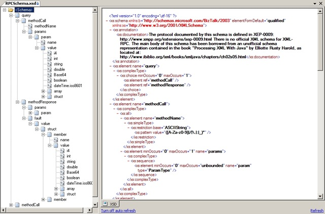

# XML-RPC Schema
This is a XML-RPC  schema that you can use in BizTalk

## What is XML-RPC

It’s a spec and a set of implementations that allow software running on disparate operating systems, running in different environments to make procedure calls over the Internet.

It’s remote procedure calling using HTTP as the transport and XML as the encoding. XML-RPC is designed to be as simple as possible, while allowing complex data structures to be transmitted, processed and returned.

You can find more information in: http://www.xmlrpc.com/ 

# About Me
**Sandro Pereira** | [DevScope](http://www.devscope.net/) | MVP & MCTS BizTalk Server 2010 | [https://blog.sandro-pereira.com/](https://blog.sandro-pereira.com/) | [@sandro_asp](https://twitter.com/sandro_asp)

